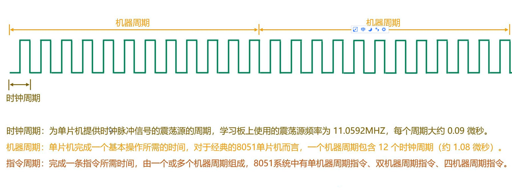
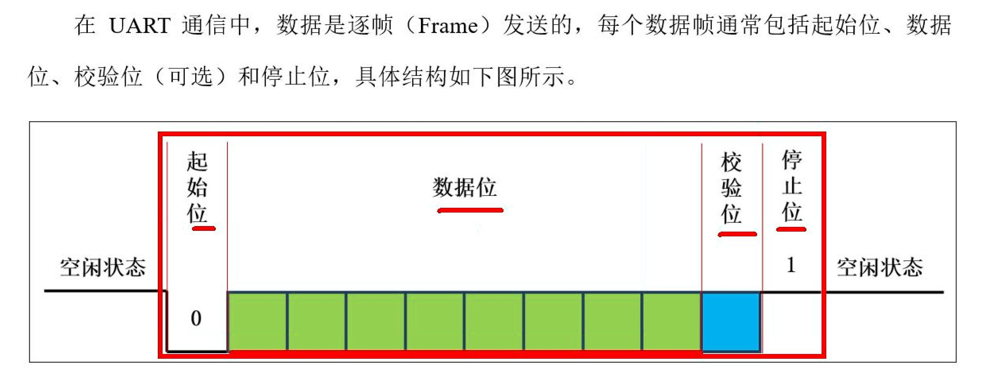

## 什么是单片机？
- 单片机是一种将中央处理器（CPU）、存储器、输入/输出接口等集成在一个芯片上的微型计算机。
- 它具有体积小、价格便宜、易于编程等特点，广泛应用于家用电器的智能控制模块，无人售卖系统、
- 医疗设备中的检测系统等。
## 51单片机概述
- 51单片机（或称8051单片机）原是指1980年由Intel公司推出的一种8位微控制器系列，现在更多
- 的指实现了8051指令集（单片机的语言）的一系列单片机。
- 多少位指的是cpu一次能处理的多少位的数据，因为cpu内部使用的寄存器组件、数据总线、ALU处理器
- 都是多少位的，比如8位那就是8位的、16位就是16位的
## STC89C52RC系列单片机命名规则
### STC89 C 52 RC - 40 I - LQFP 44
#### STC
- 深圳宏晶科技有限公司的缩写
#### 89:STC公司生产的8051内核单片机的具体型号。公司内部的一个版号
#### 工作电压
- C:5.5V-3.3V
- LE:3.6V-2.0V
#### 52 ROM 程序空间大小：可以理解为电脑的硬盘，用于存放用户程序，断电程序不丢失。（Code）
- 51:4k字节 52:8K字节 53:13k字节
- 54:16K字节 58:32K字节 516:64k字节
#### RAM大小：可以理解为电脑的内存，用于存放程序执行的过程数据，断电数据丢失。
- RC:512字节
- RD+:1280字节
#### 工作频率：频率越高，表示干活的速度越快
- 25:工作频率可达到25MHz
- 40:工作频率可达到40MHz
- 50:工作频率可达到50MHz
#### I工作温度:通常根据设备的使用场景进行选择
- I:工业级 -40℃-85℃
- C:商业级，0℃-70℃
#### 封装类型：通常根据设备的使用场景进行选择
- 如LQFP（四测引脚扁平封装）、PDIP(双列直插封装)
#### 引脚数
- 如40、41
### 电源引脚
- Vcc、Gnd
- 用于为单片机供电
### 复位引脚:RST
- 用于将单片机恢复到初始状态，以便重新运行程序，相当于电脑的重启功能
### 时钟引脚：XTAL1、XTAL2
- 用于连接时钟源，为单片机提供时钟信号
### 通用输入输出引脚（GPIO,General Purpose Input/Output）:
- P0(P0.0-P0.7)、P1(P1.0-P1.7)、P2(P2.0-P2.7)、P3(P3.0-P3.7)、P4(P4.0-P4.6)
- 可以被程序员配置为输入或输出，用于连续控制外部设备。与其他引脚(如时钟、电源等引脚)
- 相比，GPIO引脚的主要特点是通用性，可以根据应用的需求进行灵活配置。GPIO引脚只有高低
- 两种电平。
- 有些引脚除了用作GPIO，还有其他特殊功能，例如39号引脚（INT3/P4.2）,这样的引脚称为复用引脚
### 软复位
- 给电路发送复位信号，整个板子不断电
### 硬复位
- 给整个电路板断电，强行重启进行复位
### 数据类型的占用字节不同
- 与c语言不同的是 int 在c语言中是4个字节，而在51单片机中是2个字节
- 
### 开发软件安装
- 开发32位的安装
- C51的就安装
### Keil 破解
### C51 怎么和 stm32共存，MSDK共存？
- 先安装MSDK，完了再安装C51,安装C51的时候出现提示框，选择skip
### 项目目录
- 
- 
- 文件不支持中文问题？
- 可以通过Keil->Edit->Configuration->选择中文简体解决
### Keil 格式化插件
### Keil怎么添加指定芯片的型号和头文件？
- 打开stcai-isp-v6.95Z
- 选择好芯片型号
- 
- 点击添加型号和头文件到Keil中，选择Keil的安装目录即可
### Keil生成单片机可执行文件
- 单片机上支持Hex文件，不支持obj文件
- 所以需要修改一下keil使其支持十六进制文件
- build
### 烧录步骤
- 
- 怎么选择串口？
- 先连接USB线到PC，连接上之后按理来说会出现串口序列号（线必须支持数据传输）
- 
- 如果没识别到的话，需要安装串口CS340的驱动
- 先build项目，然后再用isp打开hex文件，下载到单片机
### 从0到1 芯片选型？
- 1.你看你的功能够不够用？
- 2.引脚数够不够用
- 够用就行，不用追求太高
### 模块关系图
- 
### 51案例
- 
- 
- GPIO原理
- 
- 为什么while(1)，为了不让程序退出，让单片机持续执行
- 
- 三极管的妙用，控制P3.4为低电平
- 
- 6T模式跟代码没关系，是将单片机的执行周期减半了，原先是12T，对应的现象就是led灯闪烁的更快了
- 必须下一次启动单片机时才生效，所以得进行硬复位一下（断电再上电）
- 
### 延时
- 延时在工作中一般都不用，都用计时器，计时器的效率比延时会高，因为延时会空转
- 延时的时间怎么算的，说白了就是每个指令需要的时间
- 执行每个指令需要几个时钟周期，每个时钟周期的时间知道，将函数编译成汇编语言，计算一下一共执行多少个指令
- 
- 
- 
### 单片机中要巧用二进制的与或非、异或、左移右移等运算符
### VSCode开发单片机
- 需要安装以下插件
- 
- 
- 安装完之后需要安装Donet6环境，
- 项目需要配置工具链, 比如Keil_v5/uv4/uv4.exe
- 
- 这里stc-89的头文件目录所在如下图，不同的文件夹对应的是不同的芯片厂商
- 
- 头文件编译目录设置
- 
- 
- vscode 烧录
- 没有的花需要点一下刷新，用shell自动安装一下isp或者别的烧录工具，点一下刷新
- 由于烧录用的是python命令，还得安装一下python3
- 
- 安装python依赖
```
1.安装Python（添加到PATH）
2.重启电脑，让VSCode识别到PATH
3.安装pyserial模块，cmd执行如下命令
   pip install pyserial -i https://pypi.tuna.tsinghua.edu.cn/simple
```
- 
- 如果知道串口的端口号，可以替换一下
- 
- 
- 
### 38译码器
- 节省引脚，8个低电位控制可以用38译码器来节省引脚
- 74HC138是一种三线到八线的译码器，也就是说，它可以将3位二进制输入转换成8个独立的输出信号。
- 
### 74HC245N(驱动器)
- 
### 数据传输率的问题
- 1.1 串口通信双方必须设置相同的速率。
- 1.2 波特率 boundrate/s 每一秒发送多少个码元【码元其实就是表示发送的数据单位。在8位单片机里面,
-   码元其实就是多少个bit（二进制位，一个码元等价于一个0或者一个1）】
- 1.3 比特率 bit/s 一秒钟发送多少个bit【二进制位】
- 1.4 常见的波特率： 9600【一秒钟发送9600个二进制位】 115200【一秒钟发送115200个二进制位】100万
### 数据帧【一次发送多少个数据？数据从哪到哪结束】
- 2.1 一次传输多少个二进制位
- 数据帧
- 2.2 在没有发送数据的时候，线路的信号都是高电平
- 2.3 开始要发送数据了，就把信号拉低，放一个低电平信号【0】
- 2.4 就开始发数据了。一次传输一个字节8位，把数据传输出去
- 2.5 传输结束后,就把信号拉高,表示这一次【数据帧】的数据传输结束了【1】
- 2.6 每次传输的总位数是10位，真实的数据是8位，所以串口通信的效率是80%
- 定时器
- 3.0 如果设置的波特率是9600，代表是1秒钟发送9600个二进制位，那么发送一个二进制位需要使用1/9600秒时间。
- 3.1 串口怎么直到，现在要发送出去下一个数据位了呢？它怎么知道这个时间到了，要发送下一个二进制位了？
- 3.2 芯片内部还有一种东西存在：定时器【计数器】...魏运慧老师
### 51单片机数据类型
- 
- 
## 控制一个引脚和控制一组引脚
## 项目分层
- 
## 中断系统
- 中断系统是单片机用于处理外部紧急事件的一种机制。
- 中断系统使单片机能够实时响应外部事件,提高了系统的灵活性和响应能力
- 中断源有3类、外部中断、定时器中断、串口中断
- 中断标志位就是寄存器里的某一位，表示的是这个中断有没有发生，有些标志位会在cpu处理完之后，自动复位，有些需要开发者手动复位
- 中断服务程序，就是处理数据的逻辑，就是一个函数，由cpu自己调用
### 中断序号记忆
- 计时器中断序号是1 3 5，那么外部中断就是，0,2,4,6 ，串口就是7
- 
- 
## 点阵屏和数码管
- 都是为了节省外部cpu的引脚
- 同一时刻只能点亮一行或一列，不能同时点亮多行或多列
- 所以显示都需要动态扫描
- 数码管一位一位显示，点阵屏一行一行显示
## 74HC138和76HC238的区别
- 138 输出是一个0七个1， 238的输出与138相反，是一个1七个0
## 74HC595 
- 74HC595是一种常用的8位窜行输入和并行输入的芯片，其内部有两个寄存器，一个移位寄存器和一个存储寄存器
- 移位寄存器用于接收串行数据输入，芯片会根据SCK时钟信号（上升沿）将串行输入逐位移入移位寄存器
- 存储寄存器与输出引脚相连、因为存储寄存器中的数据，就是芯片输出的数据，芯片会根据RCK时钟信号（上升沿）
- 将移位寄存器接收的串行数据一次性加载到存储寄存器进行并行输出
- 串行就是一位一位的传输
- 并行是依次传输多位的传输
- SER 串行输入
- 移位寄存器时钟 SCK
- 存储寄存器时钟 RCK
- 并行输出其实就是一次性将移位寄存器的数据存储到存储寄存器然后再一次性输出8位
- 
## 串行通讯
- 串行通讯是指数据通过一条数据线逐位传输 10100010 8位数1位1位传输
## 并行通讯
- 并行通讯是指数据通过多条数据线同时传输
- 
- 并行不适合远距离的传输，因为同时出发，不一定能做到同时到达，所以需要等所有数据都接收到再进行下一次的
## 单工通讯
- 只允许数据在一个方向上传输，即数据只能从发送端发送到接收端，不能从接收端发送到发送端
## 双工通讯
- 允许数据在两个方向上传输，其下又分为半双工和全双工
- 半双工通信，允许数据在两个方向上传输，但不能同时进行。在任何时刻，数据只能在一个方向上传输。这意味着通信的
- 两端可以轮流发送和接收数据，但不能同时进行。
- 全双工通信
- 允许数据同时在两个方向上传输，这种通信方式最为有效，因为它允许通信双方同时发送和接收数据，可以类比电话。
## 同步通讯
- 发送方和接收方使用相同的时钟信号，因为两者的时钟是同步的
## 异步通讯
- 同步发送方发送数据的频率和接收方的接收频率（波特率），这样就能保证数据的正确解析（发送方和接收方的时钟不一定同步）
## 判断同步还是异步，就看有没有时钟线
## 串口通信 UART （Universal Asynchronous Receiver/Transmitter)
- UART 异步通信，常用于微控制器与计算机、其他微控制器或外部设备之间的数据交换
- Tx用于发送数据
- Rx用于接收数据
- 异步 、串行（看有几条线）、全双工
- 51单片机中通过串口通信进行(如果TI==0)判断发送完一帧数据、和(如果RI==0)接收完一帧数据
## 数据格式
- 
- 空闲状态 协议规定，在空闲状态下，也就是没有数据传输时，应为高电平
- 起始位 表示一个数据帧的开始，起始位为低电平
- 数据位 通常为8位
- 校验位 奇偶校验 判断（数据位+校验位的）1的个数与之相反（奇数就是偶，偶数就是奇）为1，否则为0
- 停止位 表示数据位的结束，通常为1-2位，为高电平
## 波特率
- 波特率（Baud Rate）用于表示数据的传输速率，发送方和接收方必须约定好传输速率，才能保证数据被正确的发送和接收
- 需要注意波特率和比特率的区别，比特率表示每秒传输的位数，而波特率表示每秒传输的符号数。但是串口通信中，只有0
- 和1这两个符号，因为1个符号用1位就能表示，所以此处的波特率和比特率是等价的。
- 计算TL1 初始值
- 
- 
## 脉冲计数原理
- 
## 串口知识点记忆
- 1-0跳变检测器，具体来讲就是不断检测RxD引脚的起始位，当检测到1-0的跳变后，就会启动接收控制器（Rx Control)
- 接收控制器就会将接收到的数据逐位移入到输入寄存器（Input Shift Reg），直到接收到停止位，就算完成了一帧数据的接收
- 正常情况下，接下来，接收控制器会将输入移位寄存器中，并将读取中断控制位RI置1，向CPU请求中断，CPU检测到中断请求
- 后就执行相应的中断服务程序，开发者就能在中断服务程序中读取SBUF获取当前帧的数据了。
- 但是上述操作（加载数据到SBUF和RI置位）的执行是有条件的，满足条件才会执行，不满足，那么当前数据帧就会被丢弃，
- 具体条件如下：
- 1）结束位正常
- 开发者可以配置是否检测停止位的有效性（高电平有效），是否检测是由SCON寄存器中的SM2控制位来决定的，
- SM2 = 1时，接收控制器就会检测控制停止位，当SM2=0时，则不会检测停止位，建议将SM2设置为0
- 2）读取中断标志位为复位状态
- 读取中断标志位RI必须等于0，也就是说要保证上一帧数据已经被读取或处理完毕，才能处理当前帧
- 总结:接收数据需要先使能接收，也就是说要将REN控制为1，然后开启串口中断，并在中断服务程序中读取SBUF
## IIC协议通信流程
- IIC（Inter-Integrated Circuit)，通常简称IIC，是一种用在集成电路（IC）之间的串行通信总线
- 信号线 IIC为同步串行通信,使用两根线路进行通信，分别是数据线（SDA)和时钟线（SCL），SDA用于数据传输,SCL线用于数据传输的同步。
- SCL的每个时钟周期，SDA传输一位数据。
- IIC规定，数据的接收方会在每个时钟周期的高电平期间读取数据，具体来讲就是在SCL处于高电平时，读取SDA上的数据
- SDA必须在SCL的低电平期间准备好要发送的下一位数据，然后在SCL高电平期间保持稳定
- 主从架构 ,一个主设备可连接多个从设备。主设备负责发起通信和控制总线，而从设备负责相应主设备的请求。
- IIC总线中的每个设备都有一个唯一的地址（用7位二进制数字表示），用于在总线上标识自己。主设备可以根据地址选择性的的与特定的
- 从设备进行通信。
- 需要注意的是，SCL信号线上的时钟信号始终由主设备产生，而SDA信号上的数据信号既可由主设备产生，也可由从设备产生。当主设备向
- 从设备发送数据时，SDA信号由主设备产生，从设备接收信号，当主设备从从设备读取数据时，SDA信号由从设备产生，主设备接收信号。
- 空闲状态 IIC协议规定，当SDA和SCL均处于高电平时，总线为空闲状态。
- 起始和结束信号
- 主设备和从设备间的每次通信，都需要以一个起始信号开始，以一个结束信号终止。
- 起始信号：当SCL处于高电平时，SDA由高变低
- 结束信号：当SCL处于高电平时，SDA由低变高
- 为什么要这样设计起始信号和结束信号，为了区分开IIC的规定，时钟信号SDL为高电平时，读取SDA的数据，所以这个时候SDA时稳定的，
- 为了让别的设备感知到开始发数据了，所以这样设计开始信号在SCL在高电平的时候，SDK由高到低
- SCL在高电平的时候，SDA由低到高为结束信号
- 起始信号和结束信号，都只能由主设备产生。
- 确认信号 IIC协议规定，发送方每发送一个字节（8位）的数据，接收方都要向发送方回复一个1位的确认信号
- 如果确认信号为0则表示接收方成功接收到该字节，发送方可继续发送下一字节，这个信号在IIC协议中称为ACK(Acknowledge)，如果该信号
- 为1，则表示接收方未能成功接收到该字节，或者不希望接收更多数据，该信号在IIC协议中称为NACK(Not Acknowledge)。
- 从地址和读写标识
- 由于一个IIC总线上可能有多个从设备，所以开始通信前，主设备需要先与目标设备取得联系，然后再进行数据传输，除此之外，主机还需要向
- 目标设备明确本次通信的操作是写数据还是读数据
- 上述操作的实现思路如下：
- 当主设备发送起始信号之后，会向所有设备发送一个字节的数据，这一个字节中，前7位为目标设备地址，第8位为读/写标识（1表示读，0表示写）
- 当各从设备收到这个字节的数据后，会将7位地址与自身进行对比，相同则会向主设备回复确认信号，不相同则不做任何回应。当主设备收到目标
- 设备的确认信号后，便会开始与该设备进行通信
- IIC发送完开始信号之后，会发送从设备地址、读写标识
- IIC是半双工，因为一根数据线，所以只能等一方发完、另一方发
- 
- 
- 
- 
- 
- 
## OLED 
- 分辨率 128*64，单色显示
- 64行 128列 64个信号线扫描行，128个信号线扫描列
- 这种OLED屏幕一般都会带自己的驱动芯片，驱动芯片自己提供
- 跟主控芯片进行通信