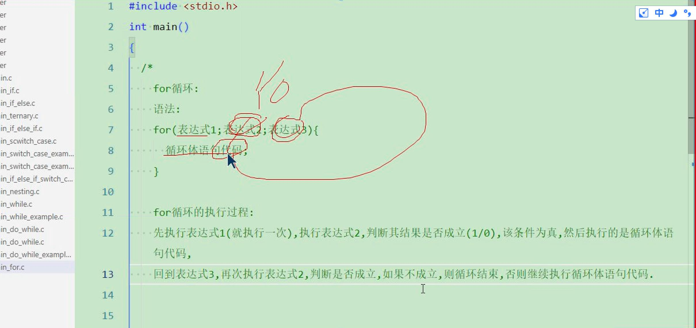

### c语言执行流程
- 
### 变量和内存的关系
- 
- 内存是程序运行时的一块存储空间，是由一个个内存空间组成的，
- 每个小内存空间有自己的地址
- 每个小的内存空间都可以称为内存存储单元，
- 正在运行的程序需要的数据也在内存中，
- 个人的信息名字，班级等都是数据
- 程序是由指令集和数据集组成的
- 
- MD5码是不能逆向破解的，MD5码网站是存了3PB的明文密码的MD5码
- .vscode 里面的task.json
```
- {
    "tasks": [
        {
            "type": "cppbuild",
            "label": "C/C++: gcc.exe build active file",
            "command": "D:\\software\\tdx_gcc\\bin\\gcc.exe",
            "args": [
                "-fdiagnostics-color=always",
                "-g",
                "-Wall",//编辑器提示警告
                "${file}",
                "-o",
                "${fileDirname}\\${fileBasenameNoExtension}.exe"
            ],
            "options": {
                "cwd": "${fileDirname}"
            },
            "problemMatcher": [
                "$gcc"
            ],
            "group": {
                "kind": "build",
                "isDefault": true
            },
            "detail": "Task generated by Debugger."
        }
    ],
    "version": "2.0.0"
}
```
- 
- 
- 
- c语言中的bool类型
- 
## 代码段
- 
## 赋值运算符
- 
- 
- 
- 按位移动的时候，结果为向下取整
## for循环
- 
- 
- 
## 数组
- 
## for循环语法
- for(表达式1；表达式2；表达式3)
- ｛循环体语句｝
- for循环执行顺序
- 先执行一次表达式1（只执行一次），再执行表达式2，判断是否满足条件，如果条件为真，执行循环体语句
- 再执行表达式3，再执行表达式2，再次重复之前
## for循环的六种写法
```
#include <stdio.h>

int main(int argc, char const *argv[])
{
    // 方式一 普通写法
    for (int i = 0; i <= 5; i++)
    {
        printf("%d \t", i);
    }

    printf("\n================================\n");
    // 方式二
    int i = 0;
    for (; i <= 5; i++)
    {
        printf("%d \t", i);
    }

    printf("\n================================\n");
    //方式三
    for(i=0;i<=5;i++)
    {
        printf("%d\t",i);
    }
    printf("\n================================\n");
    //方式四
    for(i=0;i<=5;)
    {
        printf("%d \t",i);
        i++;
    }
    printf("\n================================\n");
    //方式五
    // for(;;)
    // {
    //    //死循环
    // }

    //方式六
    for(int i = 0,j = 0;i<=5&&j<=10;i++,j++)
    {
        printf("i=%d , j=%d\t",i,j);
    }
    return 0;
}

```
## while 和 do while总结
- while 是先判断循环条件，再执行循环体语句
- do-while是先执行一次循环体语句，再判断循环条件
- 总结：while循环先判断再执行，do-while是先执行再判断
- while循环可能一次也不执行循环体语句，do-while至少执行一次循环体语句
## 不确定次数的循环
- while\do-while\for都可以实现不确定次数的循环
- while不确定循环次数 while(pwd != 123) ｛循环体语句｝
- do-while不确定循环次数 do｛循环体语句｝while(pwd!=123)
- for 不确定循环次数 for(int pwd = 0;pwd!=123;){循环体语句}
## break
- break 用来跳出switch-case语句的
- break也可以应用在循环中，循环中如果遇到break，则直接跳出所在的循环语句
## continue
- 用来结束本次循环，继续下一次循环
## goto 
- goto 是一个跳转的关键词，用来跳转的语句
- 只需要定义一个标签就行，goto 语法 ：后面跟一个标签名就行
```
	int i = 0;
	start:
	if(i<5)
	{
		printf("%d ",i);
		i++;
		goto start;
	}
```
## 数组
- 数组的长度在数组被赋值之前是可改变的，在数组的长度确定后是不可改变的
##全局变量和局部变量
- printf的时候，如果输出变量的数据，会现在局部找，找不到再去全局找
##静态局部变量
-
- 静态局部变量默认会自动初始化，但是如果默认赋值的话，必须是常量，不能用 变量
- static 可以声明静态变量、静态常量、静态函数，那么这些数据及函数只能在该文件内部使用
- extern 是用来声明外部链接，其作用：可以在当前文件使用其他文件中的数据及函数，
- 
- 
- 
## 指针
- 
## 指针运算
- 
## 内存分配
- 具体看数组在哪用的，是局部变量还是全局变量
-
-
- 先进栈的内存地址大
- 栈底的内存地址高
## 数组名不是指针
- 
## 字符数组和字符指针
-


-
##
-

- 学电子电路的目标，先做个游戏机
- 解决编码格式 
- char *str = "12324";
- 这个字面量有自己的一块内存，有自己的内存地址
- 字符数组有空间，可以读写的，字符指针是没有空间的，只是一个地址
- ptr->name = "1223"; 是将ptr->name的指针指向的内存地址为"1234"的内存地址

# c++
###  封装
- 类似于c里面的结构体，将所有的对象都放在结构体里面，c++里面就是放在类里面
### 继承
- 就是你有一个好东西，我把你拷贝过来，把你的内容拿过来，核心就是复用
### 多态
- 多态特点之一就是重载函数，同一个函数你可以传入不同的参数，实现不同的行为