## pcb
## 默认设置
- 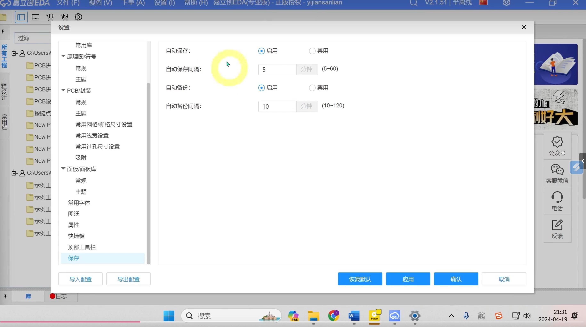
- 默认尺寸
- 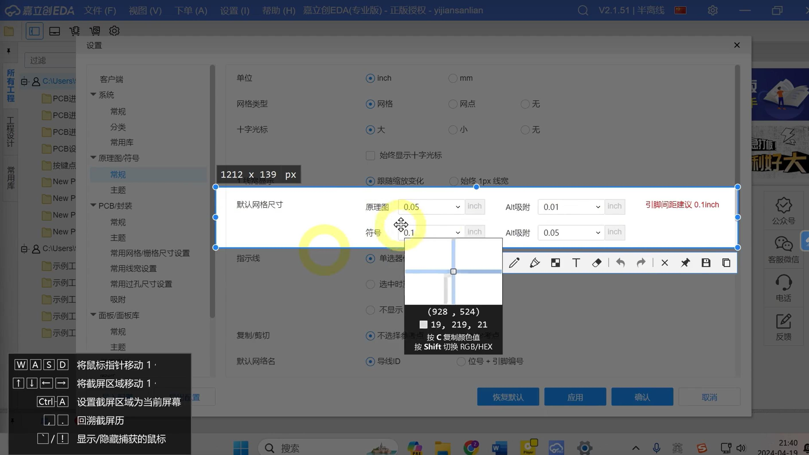
- 创建工程
- 
## led选型
- 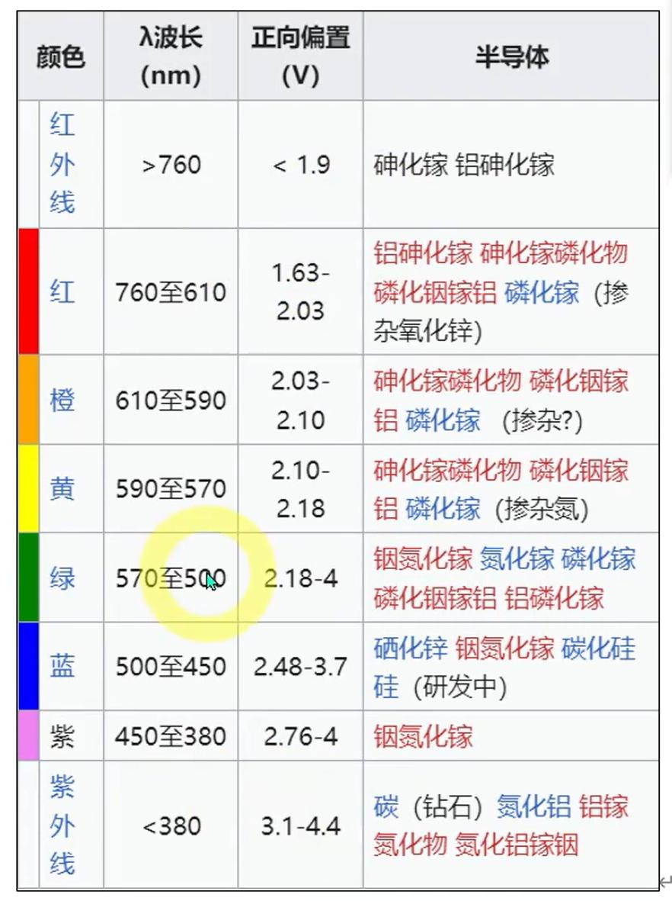
## 记忆
- shift + f 搜索元器件
- shift + h 持续高亮某个网络标识
- alt+t顶层 alt + b底层
- alt + s开启或关闭吸附
- 不用的引脚需要使用X
- 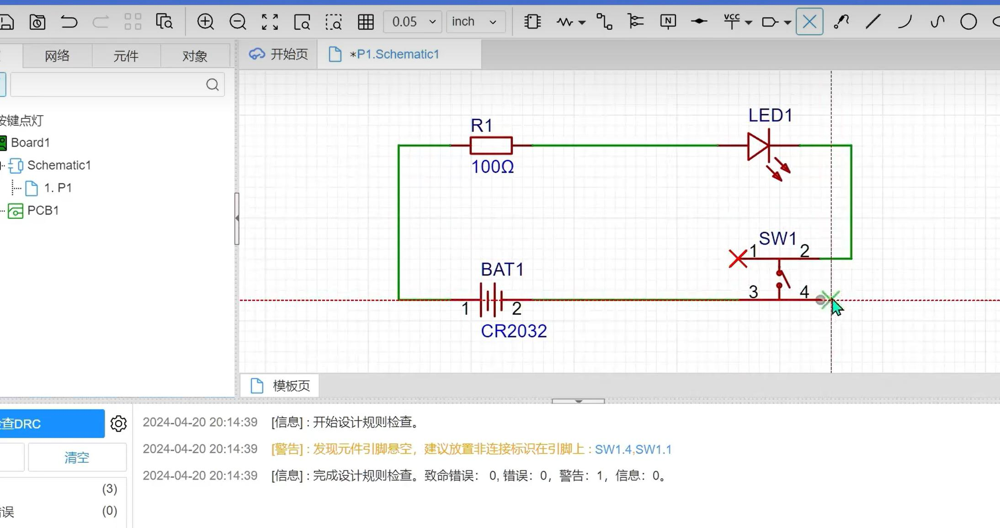
- 也可以使用内部短接
- 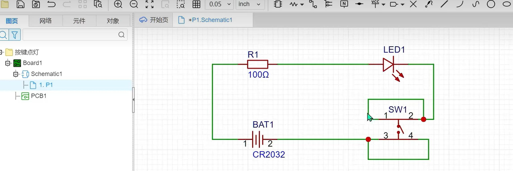
- 不同的层是不同的颜色
- 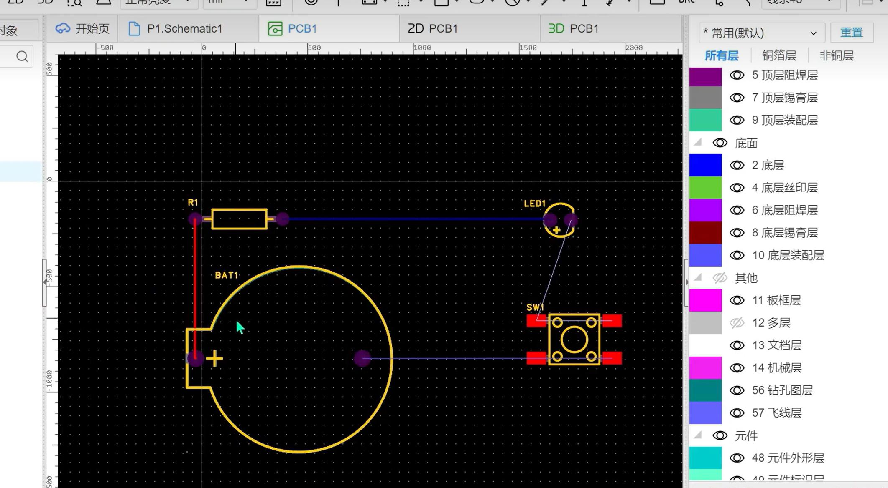
- pcb合理使用眼睛
- alt+v过孔
- 跟导线有关的单位使用英治单位mile
- 跟机械有关的单位使用毫米
- 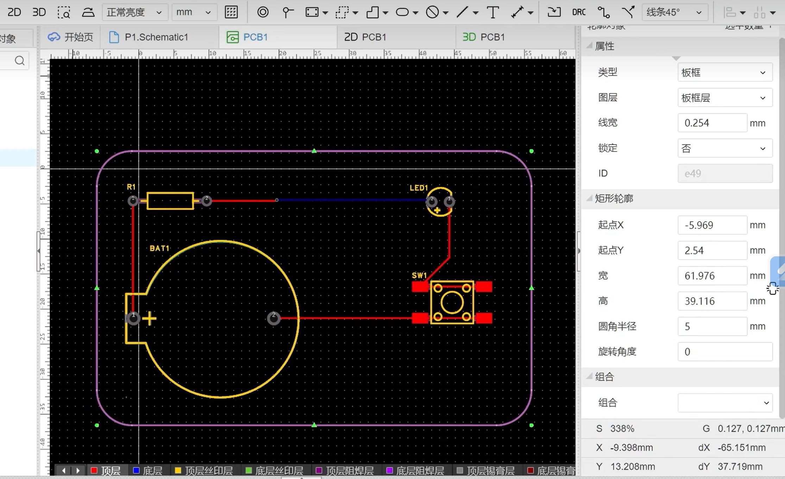
- Q键切换单位
- 网络标识；就是引脚之间的连接关系
- 有些是系统定义的，比如vcc、gnd 有些则是我们自己定义的
- 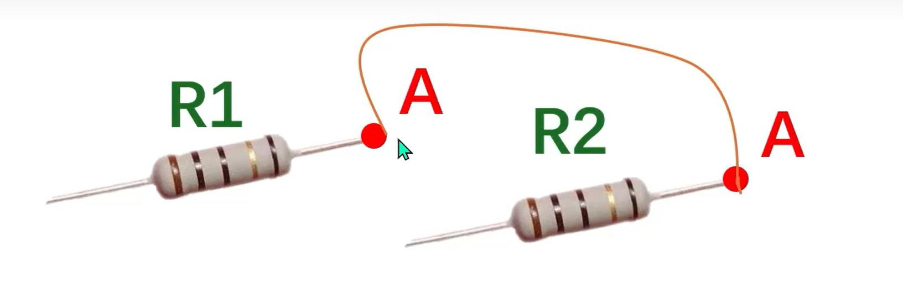
- 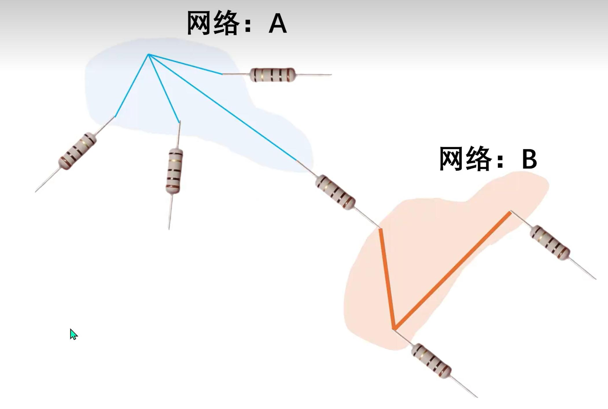
- 选中同一类元器件命名 R?
- 然后选择分配位号，会自动按顺序命名
- 选中当前页的所有元器件，再按shift+x会自动跳转到PCB页面
- 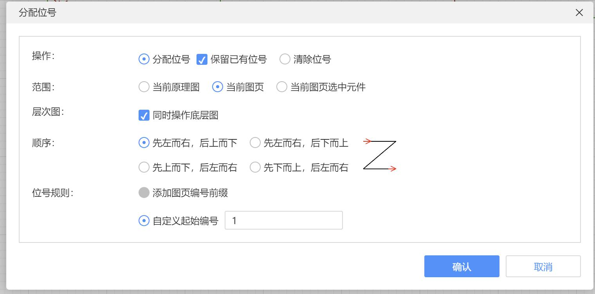
- 导线受热会升温，导线半径为多少合适呢，可以用载流计算器进行计算导线的内外半径
- 内层线宽是指4层板以上的内层的线宽，因为内层散热不太好所以线宽会粗一点，外层线宽是指双层板的线宽
- 载流能力不够的情况下，应该修改线宽，使用更宽的铜线分担热量
- 画线的时候避免出现直角
- 焊盘由发散改成直连的原因 直连则实现了焊盘与铜皮的 360° 物理接触，热阻系数较低，载流能力更好，机械强度也更大。
 - （2）散热与焊接特性对比： 发散连接的散热路径呈分散式，由于连接通道狭窄，焊接时热量聚集较慢，适合手工焊接场景。 
 - 而直连的大面积铜皮接触使散热效率显著提升，但也导致手工焊接时融锡时间延长 —— 这一特性在波峰焊等机械焊接工艺中
 - 反而成为优势，能确保焊料均匀附着。
 - 为什么pcb连续不能用直角，因为工业加工精度的问题，在用化学液体腐蚀直角铜线的时候，难免会腐蚀过多，为了应对这种
 - 问题，厂家提供了泪滴，用于平滑直角情况，使其均匀
 - 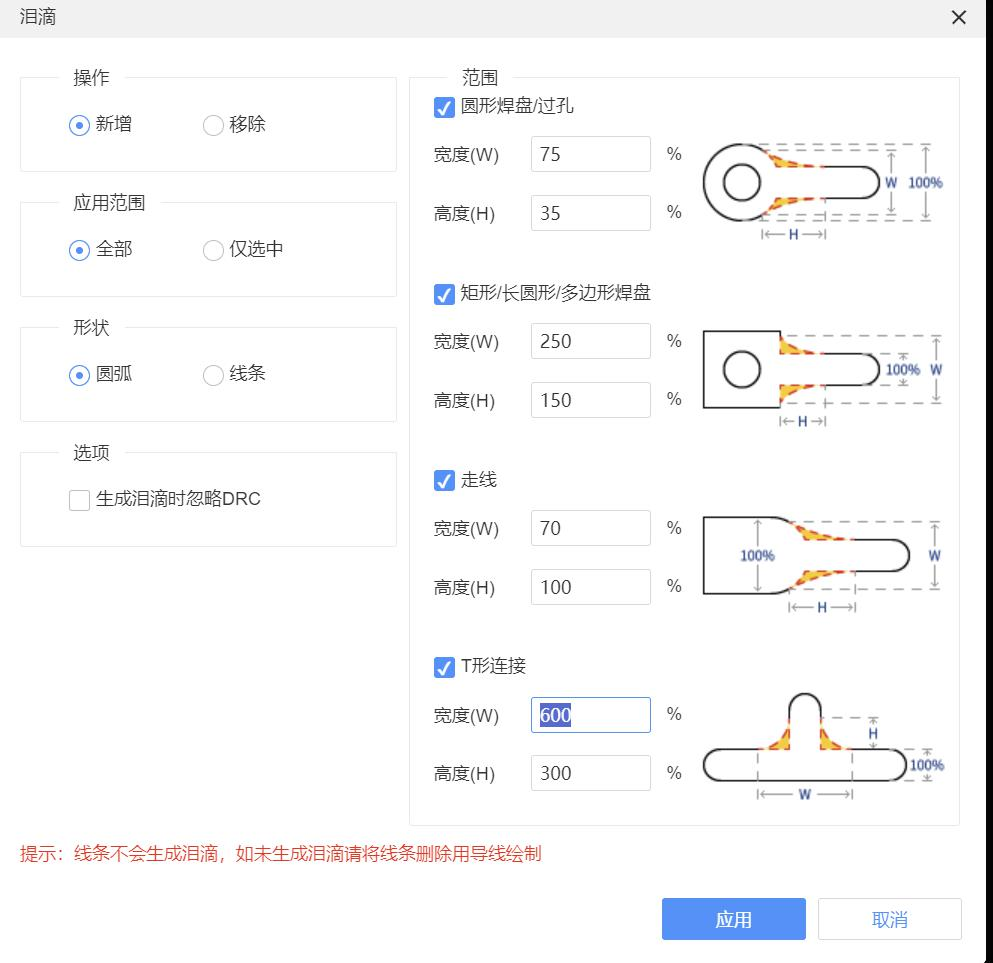
 - pcb走线的时候避免锐角，可以做成直角，因为直角的话可以通过泪滴平滑处理
 - 高低电平区别，一般是根据数据手册来定的，相当于一个区间函数，当接入电压为多少时，相对多少以下算低，多少以上算高
 - 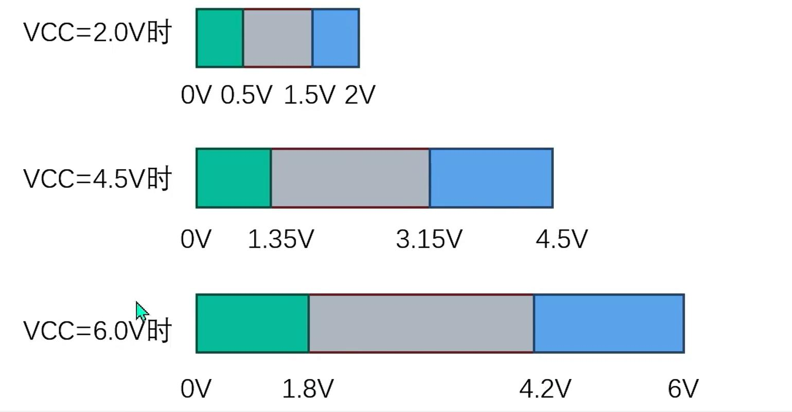
## pcb常见设计原则错误
- 导线之间间距错误，应该为>=4mile
- 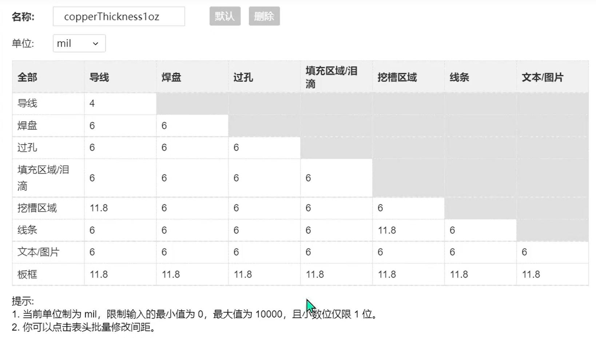
## 技巧
- 影响pcb设计间距的原因
- 
- 如果元器件下单的时候下架了，可以根据重新分配立创编号进行替换
- 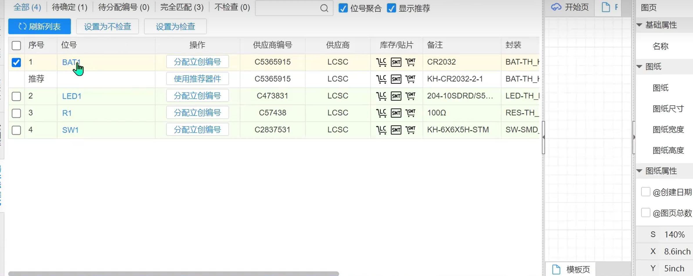
- 选型元器件的时候注意电阻妖保留冗余，比如一个led可能在1.8-2v之间进行替换,限定最大电流为0.02A，那么电阻应该怎么选择
- （3.3 - 1.8）/0.01A - （3.3-2）/0.01A = 120欧姆-140欧姆
- 电源排针的距离尽量要远一点，因为要用万用表或电源线夹子连接，如果太近的话可能会造成电源短路
- 排针不能距离太近，不然跳线帽可以插在一个排针的VCC和另一个排针的GND容易造成芯片的短路，可以把间距设为一个排针的距离
- 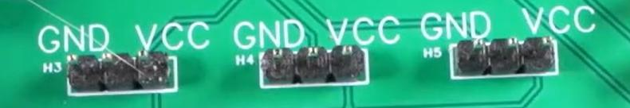
- 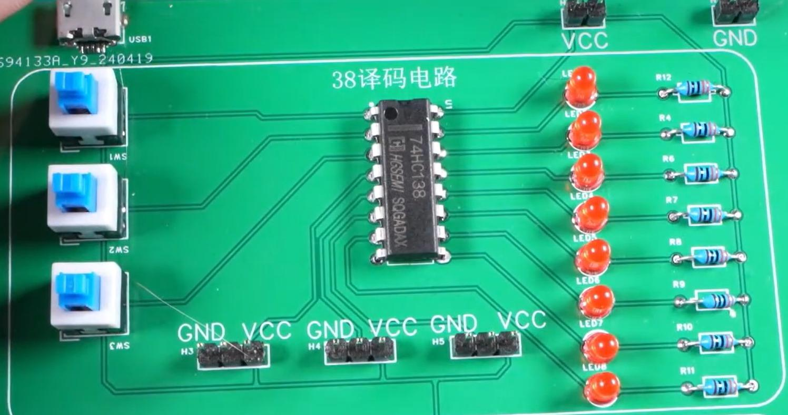
- 垂直等距分布是根据第一个和最后一个选中对象的位置对中间的对象进行垂直等距分布
- 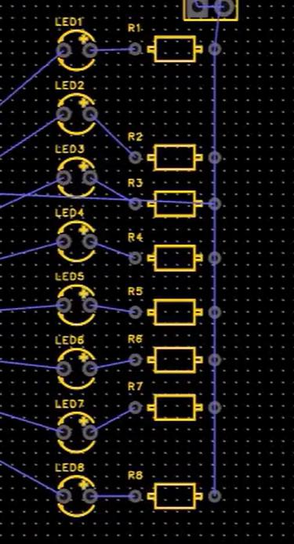
- pcb画线从vcc连接开始
## 常用插件库
- 排针
- 3排针的用法，一端接vcc、一端接gnd,中间连接引脚，使用跳线帽控制高电平还是低电平
- 开关
- 电阻
- 跳线帽（排针+跳线帽的组合相对开关比较便宜）
- 74hc245信号放大器原理
- 其实就是芯片内部接了一个开关，一端接vcc，一端接gnd，使用输入引脚控制开关方向，芯片起了一个中继作用
- 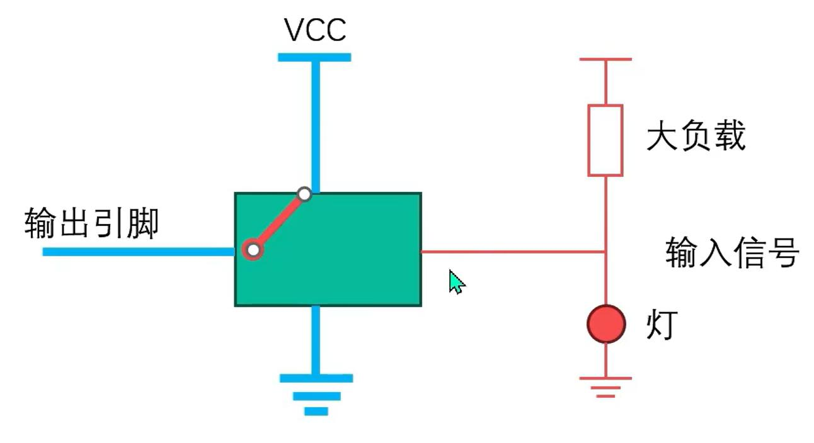
- 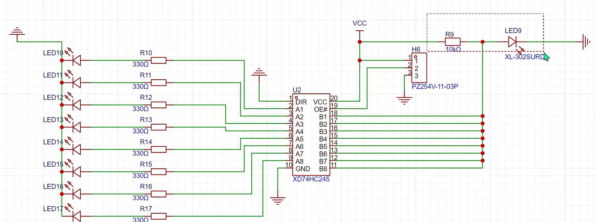
## 数据手册结构
- 