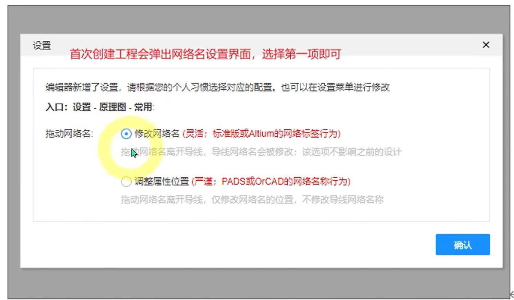

## pcb
## 默认设置
- 
- 默认尺寸
- 
- 创建工程
- 
## led选型
- 
## 记忆
- shift + f 搜索元器件
- shift + h 持续高亮某个网络标识
- alt+t顶层 alt + b底层
- alt + s开启或关闭吸附
- shift + 折线 始终保持拉直
- alt + 折线 可以到边界
- shift + d 点对齐
- alt+w 之后按tab键可以输入线宽
- 选中丝印文字 ctrl+f 再点击查找全部，可以通过属性修改全部字体
- 不用的引脚需要使用X
- 
- 也可以使用内部短接
- 
- 不同的层是不同的颜色
- 
- pcb合理使用眼睛
- alt+v过孔
- 跟导线有关的单位使用英治单位mile
- 跟机械有关的单位使用毫米
- 
- Q键切换单位
- 网络标识；就是引脚之间的连接关系
- 有些是系统定义的，比如vcc、gnd 有些则是我们自己定义的
- 
- 
- 选中同一类元器件命名 R?
- 然后选择分配位号，会自动按顺序命名
- 选中当前页的所有元器件，再按shift+x会自动跳转到PCB页面
- 
- 导线受热会升温，导线半径为多少合适呢，可以用载流计算器进行计算导线的内外半径
- 内层线宽是指4层板以上的内层的线宽，因为内层散热不太好所以线宽会粗一点，外层线宽是指双层板的线宽
- 载流能力不够的情况下，应该修改线宽，使用更宽的铜线分担热量
- 画线的时候避免出现直角
- 焊盘由发散改成直连的原因 直连则实现了焊盘与铜皮的 360° 物理接触，热阻系数较低，载流能力更好，机械强度也更大。
 - （2）散热与焊接特性对比： 发散连接的散热路径呈分散式，由于连接通道狭窄，焊接时热量聚集较慢，适合手工焊接场景。 
 - 而直连的大面积铜皮接触使散热效率显著提升，但也导致手工焊接时融锡时间延长 —— 这一特性在波峰焊等机械焊接工艺中
 - 反而成为优势，能确保焊料均匀附着。
 - 为什么pcb连续不能用直角，因为工业加工精度的问题，在用化学液体腐蚀直角铜线的时候，难免会腐蚀过多，为了应对这种
 - 问题，厂家提供了泪滴，用于平滑直角情况，使其均匀
 - 
 - pcb走线的时候避免锐角，可以做成直角，因为直角的话可以通过泪滴平滑处理
 - 高低电平区别，一般是根据数据手册来定的，相当于一个区间函数，当接入电压为多少时，相对多少以下算低，多少以上算高
 - 
 - rxd receive data
 - txt transmit data
 - 短接标识的意思，将两个标识直接短路连接，相当于一个引脚有两个名字，一个p30，一个rxd
 -  
 - 滤波电容进行pcb连线的时候，一定要先经过电容，再去连接引脚，这样可以让滤波做到最优
 - 
 - 
 - 
 - 晶振包含晶振引脚XTAL1\XTAL2、logo丝印禁止铺铜
 - 晶振的画线不要超过禁止区域
 - 
 - 
 - pcb摆放的时候还是要紧凑点，从电源模块开始放，各模块排版的时候根据线的距离来摆放
 - 布线的时候也是先从电源开始
 - 连接电源线的时候，线宽一定要根据最大电流的*1.5上限去计算线宽
 - USBD+与USBD- 要进行差分连线，因为是差分协议，差分信号抗干扰能力低
 - 
 - 然后进行差分对布线，可以再进行等长调节进行调整
 - 不能打斜线，要横平竖直
 - 
## pcb常见设计原则错误
- 导线之间间距错误，应该为>=4mile
- 
## 技巧
- 影响pcb设计间距的原因
- 
- 绘制完板框可以进行锁定操作
- 如果元器件下单的时候下架了，可以根据重新分配立创编号进行替换
- 
- 选型元器件的时候注意电阻妖保留冗余，比如一个led可能在1.8-2v之间进行替换,限定最大电流为0.02A，那么电阻应该怎么选择
- （3.3 - 1.8）/0.01A - （3.3-2）/0.01A = 120欧姆-140欧姆
- 电源排针的距离尽量要远一点，因为要用万用表或电源线夹子连接，如果太近的话可能会造成电源短路
- 排针不能距离太近，不然跳线帽可以插在一个排针的VCC和另一个排针的GND容易造成芯片的短路，可以把间距设为一个排针的距离
- 电源的正负极一定是不能接一块的，短路短路短路
- 
- 
- 垂直等距分布是根据第一个和最后一个选中对象的位置对中间的对象进行垂直等距分布
- 
- pcb画线从vcc连接开始
- 扇出网络标识，导出excel，ctrl+h进行替换.为空，效率高
- 水平等距排布的时候不要解锁锁定
- 
- 创建阵列工具，不要一个一个去复制
- 
- 孤岛问题可以通过放置过孔去解决
- 添加过孔增强载流能力
- 放置缝合空，增强上下两层同皮的载流能力
- 
- 封装
- 
## 常用插件库
- 排针
- 3排针的用法，一端接vcc、一端接gnd,中间连接引脚，使用跳线帽控制高电平还是低电平
- 开关
- 电阻
- 跳线帽（排针+跳线帽的组合相对开关比较便宜）
- 74hc245信号放大器原理
- 其实就是芯片内部接了一个开关，一端接vcc，一端接gnd，使用输入引脚控制开关方向，芯片起了一个中继作用
- 
- 
- 保险丝 是对电流敏感的一个元件（保持电流、跳闸电流）
- 电容 是对电压敏感的一个元件(没电时相当于短路，充满电相当于断路)
- 如下，如果电压先突变，保险丝并不会感受到电压变化，而是会把电压放过去，导致电容被击穿，此时电源短路，产生很大的电流
- 此时保险丝才会断开
- 
- 所以说保险丝并不能保证我这个电路板上的所有元器件并不会出问题，但是它可以保证出问题了，灾难不会进一步扩大
- 保险丝是透明的还好，如果不是透明的，你得使用万用表去测量通断，保险丝焊接的话，如果需要更换的话需要用电烙铁把原先的拆掉，再焊接上去
- 所以保险丝一般用自恢复保险丝省事点（自恢复保险丝工作原理，温度太高的话会膨胀，温度冷却下来会恢复成一条线）
- 稳压器，5V转3.3V
- CH340N翻译芯片，将usb信号翻译为ttl信号
- CH340N在空闲时，RXD和TXD会保持5V电压，所以会出现向芯片灌电的问题
- 注意去官网查看文档，立创商城的文档可能不太新
- 肖特基二极管，导通和关闭都特别快，稳压
## 数据手册结构
- 
## SMT基础库和SMT扩展库
- SMT基础库是嘉立创生产机器上默认的元器件，SMT扩展库是需要人工去换的元器件
- 如果你想让嘉立创帮你焊接的话，是有这么一个换料费用的，根据你在扩展库的种类个数进行收费的，比如你一共有20种元器件，
- 有10中扩展库的，那么收费就是10*20（换料单价）
- 如果你是买回来自己焊接，那价钱就是一样的
## 选型元器件，需要衡量元器件大小，额定电压，精度
## 为什么要用5V转3.3V？或为什么要用稳压器？
- 因为51或32的工作电压是3.3V，而type的最小供电电压是5V
## 复位电路开关为什么要并联一个电容？
- 首先有一个复位开关，按一下闭合，松开会断开电路
- 因为要检测到复位信号，如果不接电容的话，断开时间会很短就闭合了，接了电容后，按钮按下的时候会有瞬间到一个高电平，然后，慢慢下降
- 就算我们按下的时间很短，也会有一段时间能得到高电平，只要这个高电平时间比较长，单片机就能捕捉到这个信号。使用电容 延长一下高电平
- 
- 开关闭合时，dst会瞬间到一个高电平（电容迅速放电），开关断开之后，电容会充电，分担的电压会越来越大，直到充满，dst引脚的电压会越来越小，
- 这才是单片机能捕捉dst引脚的信号
- 
## mcu供电指示灯为什么要接一个1k欧姆的电阻？
- 因为这个指示灯没必要那么亮，接一个1k欧姆的完全没问题
- 
## 电脑时通过差分协议进行传递信号的，单片机识别不了这种信号，所以需要一个差分信号转ttl,只有这样电脑才能跟单片机进行通信
- 
- 注意差分信号转ttl的rts是自动冷启动引脚，不是rst引脚
- rts request to send 请求去发送，在嵌入式领域，像这种在发送数据前，都会发送一个请求通知，提前通知对方的操作，叫做硬件控制流
- 硬件控制流的作用就是让下游把手头的活停下来，等发送完再执行
- rts低电平数据传输
- 
## 通信指示灯为什么这样画？
- 并联一个指示灯和电阻接到电源，这样就能方便观察传输低电平的时候指示灯会亮
- 
## 推挽输出（高、低、高阻态三种状态）
- 推挽输出其实是看我们内部的电路状态
- 如果内部连接的是vcc，外部连接的是一个用电器，那么就相当于从内部把电流推出去
- 如果内部连接的是gnd，外部连接的是一个用电器，那么就相当于从内部把外部的电流拉进来
- 
- 很巧妙的利用p沟道和n沟道mos管进行开关控制
## 开漏输出 （高阻态 和 低电平两种装态）
- 内部只有一个接地的mos管，漏极接的是外部引脚，所以叫开漏输出
- 
## 如何让开漏输出有高低两种状态，避免高阻态
- 外部接一个上拉电阻和vcc
- 
## 开漏输出和推挽输出的区别？
- 开漏输出的上拉电压更灵活，可以根据外部用电器的电压去灵活调节
- 推挽输出的电压比较依赖单片机的电压
## 为什么51的P0需要接上拉电阻？
- 因为作为i/o输出口时，P0引脚是开漏输出，所以需要接上拉电阻
- 
- 
## mcu只有在开机时才会做信号检查？
- 所以在没有冷启动模块时只有在重新进行烧录下载时，必须对mcu进行复位才行，否则就会ch340N就会阻塞
- 冷启动就是强行断电，跟复位的断电不是一回事
## 自动冷启动电路
- 
- VCC_SW 就是输出开关，连接的是单片机电源开关
- 利用电容的充放电原理巧妙的实现高低高的信号
- 
- 
- 
- 局限性 点击下载的时间间隔不能太短，如果太短的话，电容的电还没放完，又处于充电状态