## stm32
### Arm
- Arm 是一家做芯片设计方案的公司
- Arm也是处理器架构，几乎所有的移动端处理器均采用ARM授权方案设计
- CPU架构要么就是Intel要么就是AMD(x86架构)
- x86架构就是复杂指令集CISC
- arm架构是精简指令集RISC
- 这就是量大指令集的发展方向
- 对于电脑或者笔记本来，性能要求是比较高的，所以适合使用x86架构，复杂指令集
- 对于移动端或者嵌入式领域来说，性能要求不是那么高，主要是要集成度、体积小、功耗要低
- 所以这个场景适合精简指令集架构
- 笔记本平板之类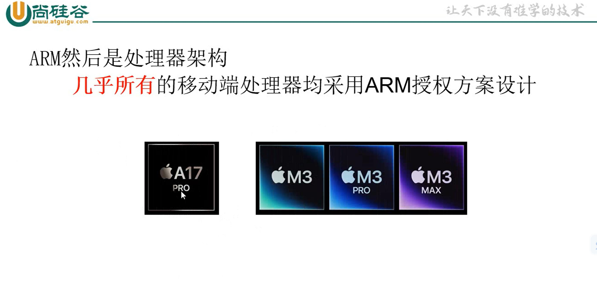 手机芯片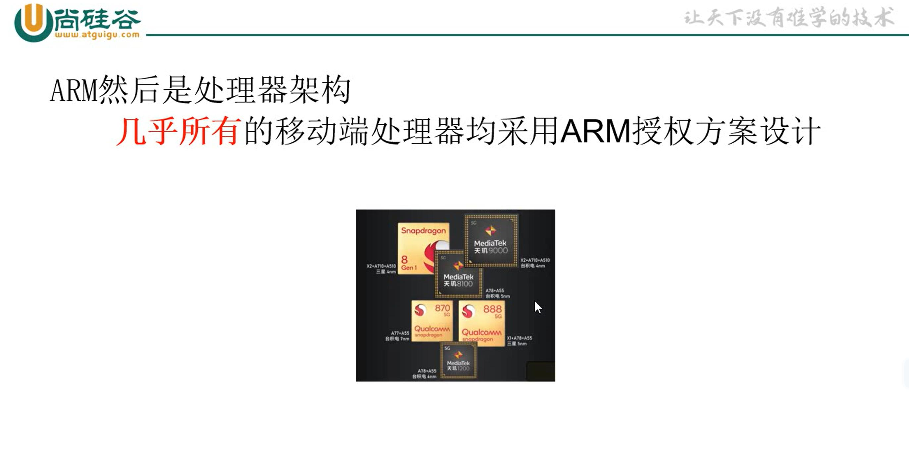
- 华为的麒麟970芯片用的他们自研的泰山架构（也是也是根据armv8架构进行调整优化改进之后发展
- 出来的一个架构）华为本身有armv8芯片的永久授权的，可以做各种各样的改动，根据自己的需求
- 去做进一步的优化 
- 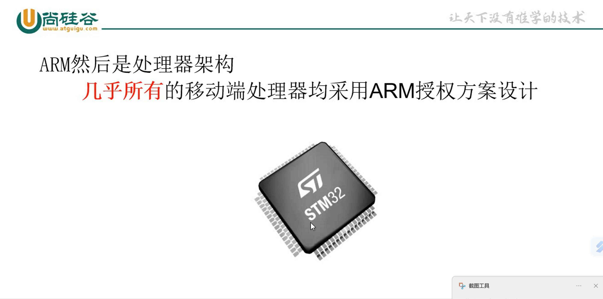
- 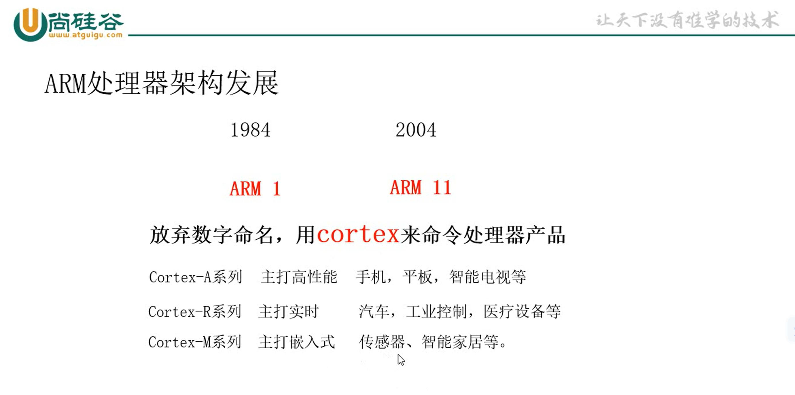
- STM32芯片介绍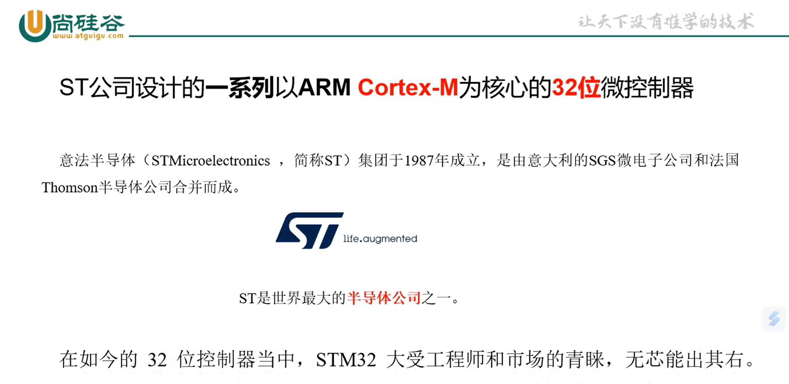
- STM32是一个大家族
- 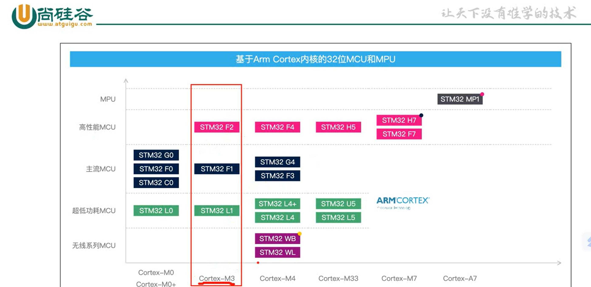
- stm32应用场景
- 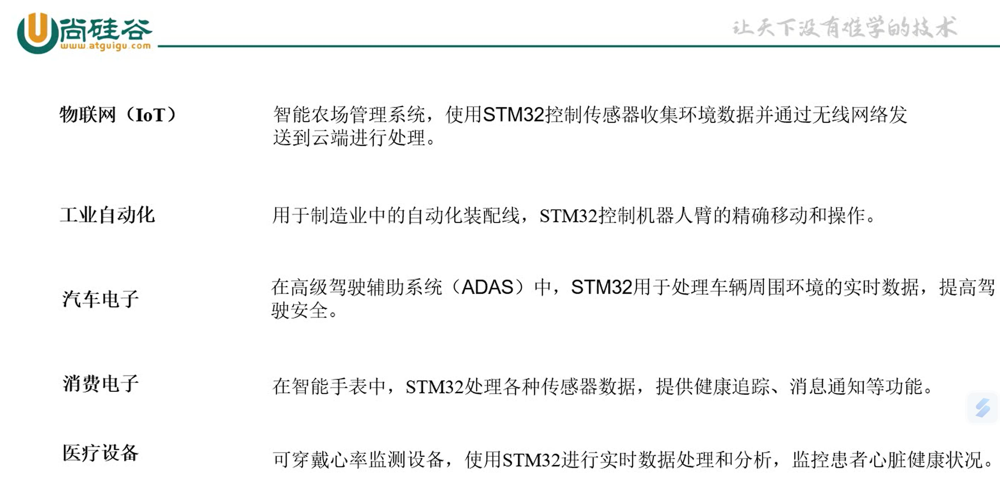
- 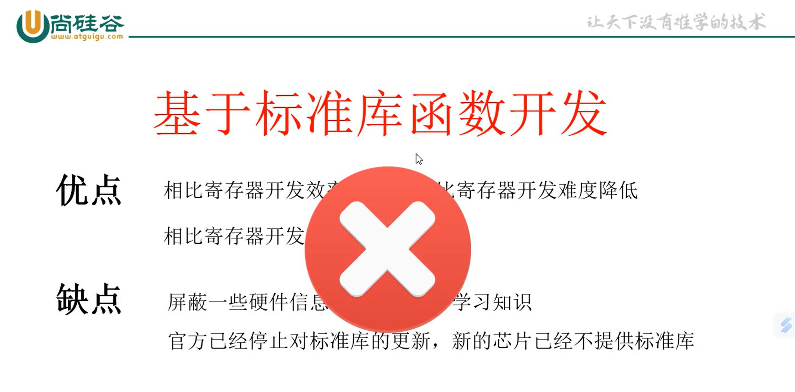
- 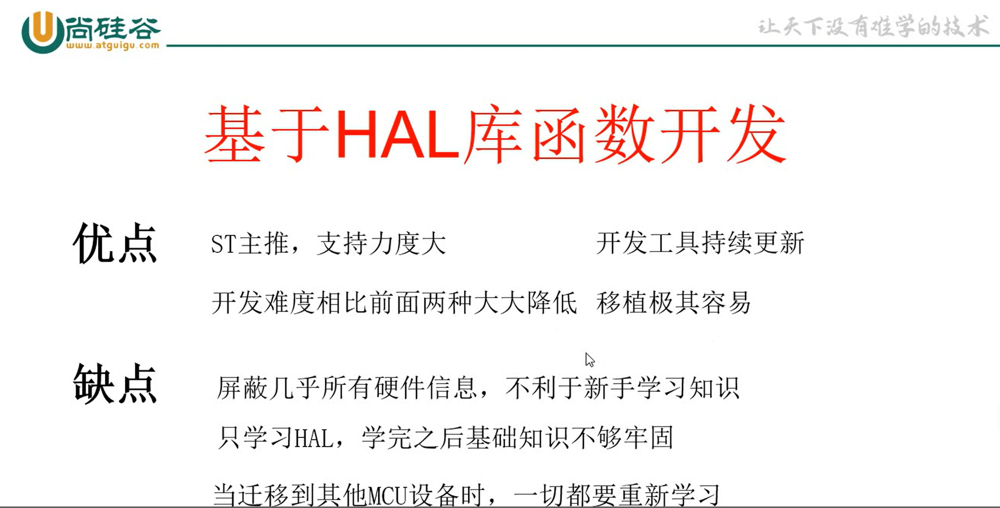
- 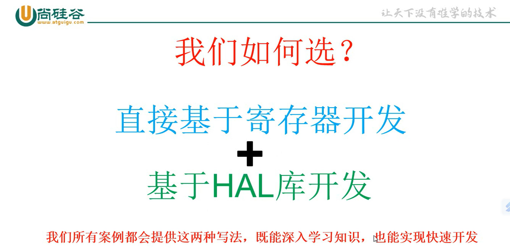
### 开发环境
- 工具选择
- 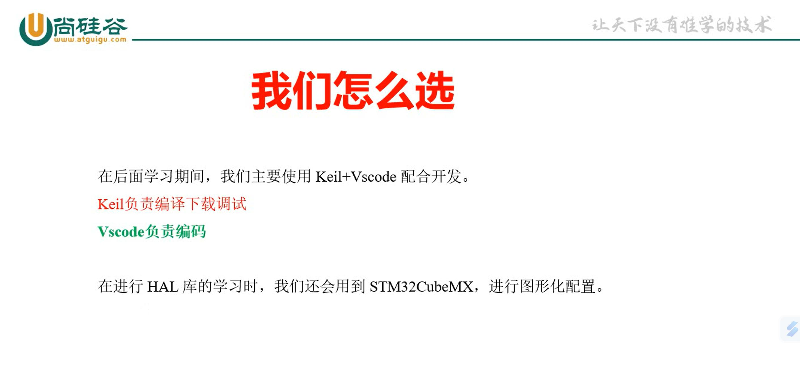
### STM32最小系统
- STM32单片机能工作的最小外围电路就叫最小系统
- 最小系统通常包括：STM32芯片、电源、时钟、下载调试和复位5部分组成。