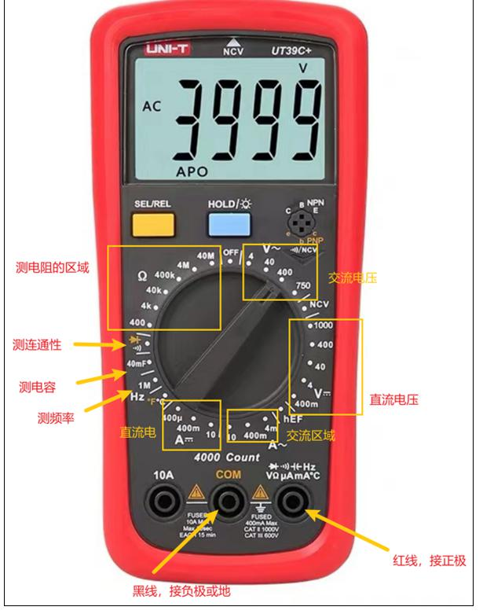

## 万用表的使用
- 测什么的时候需要将黑表笔连接到万用表的com端
- 红表笔连接到电压或电阻或电流端
-  
- 
- 
- 
### 测量交流电压
- 测量交流电压 
- 通常测量电压时,将黑表笔接GND,红表笔测量不同的电压
### 电流测量
- 直流电流的测量,万用表的黑表笔接COM端，红表笔接20A或mA，功能选择到A-代表是直流电流，量程选择到20A
- 测量电流一定要把万用表串联在电路中,把它当根导线用
-  
### 电阻测量
- 黑表笔的一头在COM端，红表笔的一头在vΩ端，功能选择到欧姆的档位，选择好合适的量程
- 注意 测量电阻的时候一定要把电路中的电先断掉
- 测量可调节电阻的时候，要把表笔连接在滑动电阻的可滑动引脚和输入引脚
## 万用表的蜂鸣器系统 主要用来测量线路通不通，通的话会发出滴滴的生硬
- 判断led的好坏，注意，测量led时，一定要把所在的电路的电源断开
- 