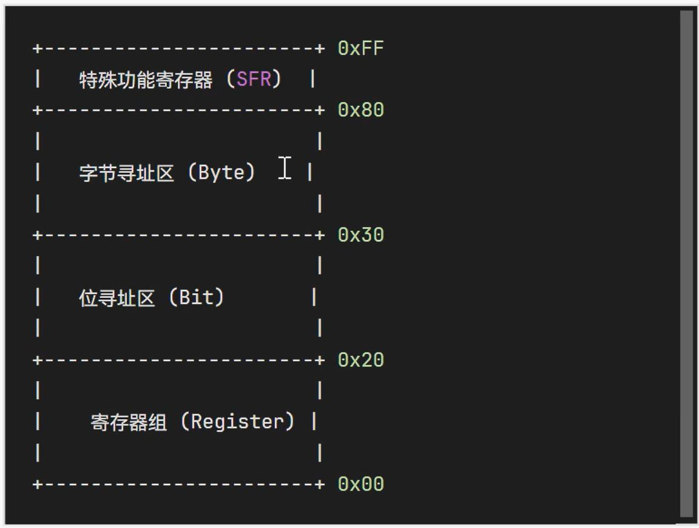
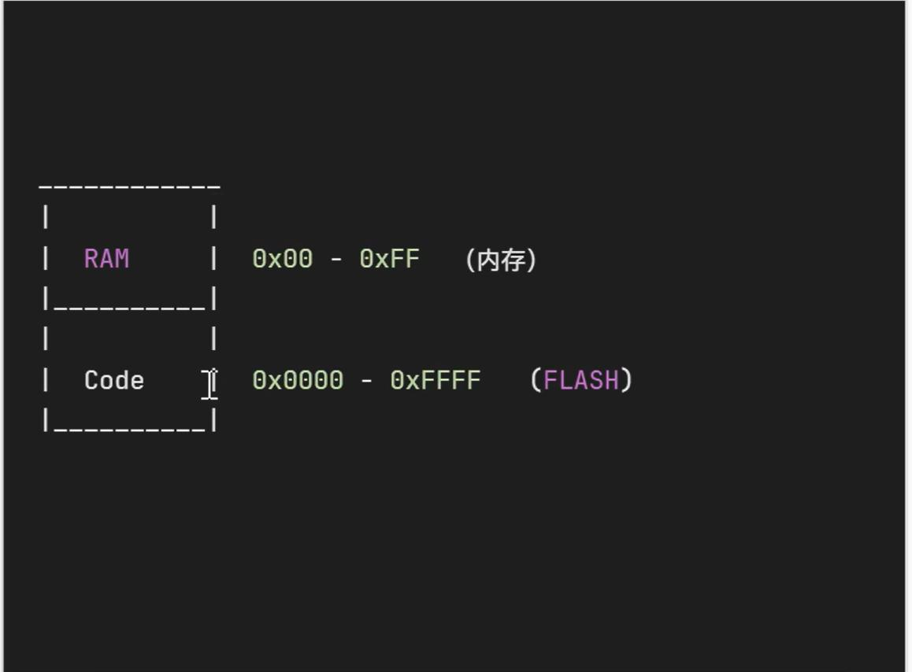

## 操作系统
- 操作系统概念 幼儿园场景
- 系统资源 玩具、游戏场地、秒表、定时器等（内存资源、定时器资源、外设资源、IO资源）
- 任务 小朋友想做的事情（玩游戏、学习等）（挂起状态、停止状态、就绪状态）
- 进程 小朋友正在进行的活动（画画、玩积木等）
- 顺序执行 老师一次满足每个小朋友的需求
- 多任务并行 老师同时满足多个小朋友的需求
- 任务优先级 根据小朋友的需求紧急成都安排先后顺序
- 任务切换 老师在不同小朋友的需求之间切换
- 时间片 老师给每个小朋友分配的一段时间
- 上下文切换 老师在满足一个小朋友的部分需求后，快速切换满足另一个小朋友的需求
- 上下文保存 老师切换前记住另一个小朋友的状态，方便一会儿接着积蓄满足他的需求
- 中断 突发事件（如小朋友摔倒）导致老师暂停当前活动，处理紧急事件
- 资源争抢与解决方法 多个小朋友争抢玩具，老师协调和安排轮流使用或分享
- 实时操作系统 老师能够实时满足小朋友的需求，并保证完成任务的时间要求
- 非实时操作系统 老师满足小朋友的需求，但不能保证严格的时间要求
- 硬实时 老师必须在规定时间内完成任务，否则会产生严重后果
- 软实时 老师尽量在规定时间内完成任务，但延迟不会产生严重后果
## 时间片轮换
- 优先级分配，确保根据任务的优先级来分配资源
- 确保所有任务都能公平的使用资源，只要你切换的足够快，就不会感受到你不是在独占cpu，
- 比如时间管理大师，当一个任务的时间片用完时，另一个任务就可以使用资源。这种方式
- 可以防止某个任务长时间独占资源。
- 通过使用优先级分配、时间片轮转方法，操作系统能够在任务之间合理的分配有限的资源。
- 确保每个任务都能满足自己的需求。计算机操作系统就是用这些方法来管理不同任务之间
- 的资源争抢问题。
## 8051单片机的内存结构
- 寄存器组：地址范围为0x00-0x1F。包含了4组8位寄存器、分别为R0-R7，对应的寄存器组
- 选择由PSW中的RS0和RS1位控制
- 位寻址区：地址范围为0x20-0x2F，包含了128位，可以直接使用位操作指令进行访问。
- 字节寻址区：地址范围为0x30-0x7F，用于一般数据存储。
- 特殊功能寄存器（SFR）: 地址范围为0x80-0xFF,包含了所有特殊功能寄存器，如P0、P1
- P2、P3等端口寄存器、ACC累加器、B寄存器、SP栈指针等。
- 
- 0x0000到OxFFFF，这是程序存储器的地址范围，用于存储程序代码。这些数据是存储在FLASH中的。
- Flash存储器用于存储程序代码，而RAM用于存储临时数据、变量、堆栈等。程序代码从Flash存储器
- 中加载到RAM中，然后由CPU执行
- 为什么代码会在Flash中，因为flash的特性断电之后还会保存
## 程序执行顺序切换
- 前面我们自己动手设计的计算机系统，通过修改PC的值可以修改下一行要执行的程序的汇编
- 代码的位置，但真实的stc单片机是没有汇编语言修改PC的值的，因为程序计数器通常是由
- 硬件自动递增的，用于指向将要执行的下一条指令的地址。
- 但是我们可以通过其他的手段达到间接修改PC值的目的，汇编语言中有JUMP跳转指令，有CALL
- 指令。这两个指令的区别就是有没有修改SP（堆栈指针StackPointer）的内容。