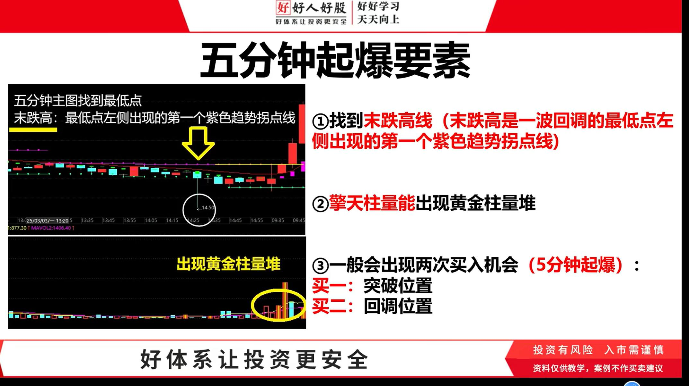
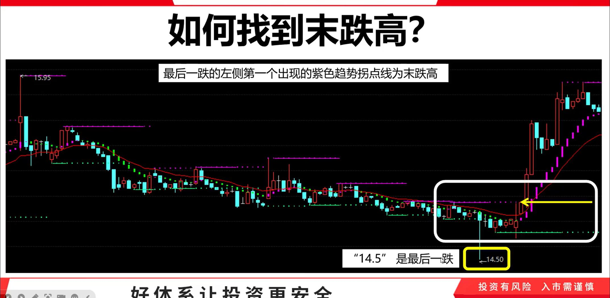
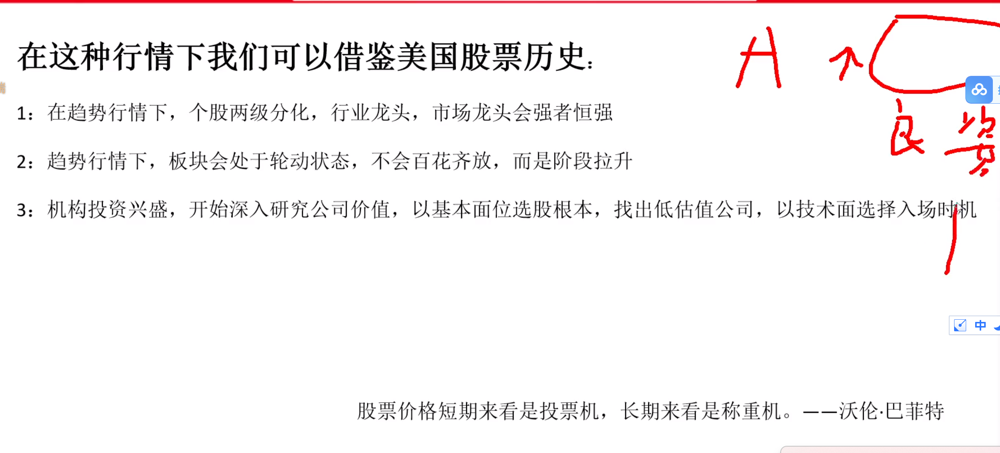

## 买股条件
- 一涨二回主力试盘三主升，前面还要有大跌
## 一涨的条件
- 有红色筹码峰
- 有主力
- 多空趋势由蓝转紫
## 一高二高的判断条件
- 一高是上涨过程中最高的那个点
- 二高是根据紫色趋势拐点去找
## 主力试盘的识别
- 得突破二高
- 得出现主力信号
- 筹码峰双线合一
- 主力信号是检测大资金进出的，如果没检测到，那说明主力拉涨停不是大资金拉的
- 主力试盘出现涨停板，不需要看主力信号
## 买点
- 试盘之后等黄金坑
- 等待筹码峰的双线合一，再介入
- 不买下跌趋势中的深海鱼钩
- 单峰密集
- 双线合一
- 黄线在紫线下面
## 主力强不强跟他涨的多不多没关系，而是跟涨的速度有关系，7天涨一倍肯定比一年涨一倍的股票强
- 下跌优中选优下跌要超过百分之五十，下跌的越多，后续上涨的空间才会越大，出现抄底先锋
- 一涨优中选优，要强，最好能扭转前面的下跌趋势，最好出现涨的快，最好出现连续涨停板，涨幅要求，不能超过两倍，不能涨的太多，因为涨
- 的太多，会压缩三浪的空间
- 试盘的优先标准，最好出现涨停板（优中选优）
## 不做急功近利者，坚持长期主义，不做一锤子买卖
## 从本质解决亏钱的问题和赚什么钱的问题
## 先守住下限
## 只做自己了解的股票
## 顺势而为，做趋势
## 做笨功夫
## 双线合一背后的逻辑
- 是主力用自己的钱去拉升，其实不是，其实是主力将市场的成本洗到自己的成本线
## 广义的双线合一
- 黄色的平均成本线和顶格筹码峰大部分重合
- 平均成本
- 黄色线在紫色线下面
- 金融市场一定要计算到很精确，不然很容易钱被其他人卷跑
## 做股票一定要严谨
- 
### 一高在20%到100%之间比较好一点，超过100%的尽量不优选
- 
- 
### 二高必须出现趋势拐点线才算二高
- 
### 三高如果超过1高5%范围以内是可以的
- 
- 
- 
- 
- 
- 
### 3高试盘回调注意事项 形态优选快涨缓跌
- 大阳线 资金共识度高
- 
- 
- 
- 
- 
### 双踩模型，同时踩到多空趋势线和操盘线，踩破了不算
- 
- 实体在操盘线之上是有效的
- 
- 
### 分时图
- 黄色线代表平均成本
- 白色线代表实时股价
- 
- 
- 
### 优选总结
- 
- 初期小资金训练实战
### 总结
- 
- 
- 
- 
- 
### 五分钟起爆
- 
- 
- 
- 
- 
- 
- 
- 
### 买点
- 
- 
- 
- 
- 5分钟倍量堆，并且突破可以买
- 主升模型的
- 恒生电子
- 300274 阳光电源
- 双环传动
- 机会是跌出来的，风险是涨出来的
### 长牛慢牛的另一视角
- 
### 啥是末跌高
- 
- 
- 为什么双踩，要在尾盘买，为了安全，把t+1做成t+0
- 为什么单踩，要看5分钟，为了怕踏空，它直接向上突破
### 股票
- 万马科技
###  十五五会议
- 上海 北京 深圳国企改革 重组 提效
- 
- 
- 
- 
- 
- 跟AI有关的半导体才涨的
- 885578 基因技术
- 
### 长线一般看行业 新能源电池、低空等 
### 短线 概念 => 朦胧 新 解释不清 一般最多炒一个月
###医疗龙头 康明康德
### 指数解决（仓位、体系）
### 板块解决（方向）
### 个股（体系去筛选，优中选优）
### 仓位管理
- 
- 
- 
- 
- 
### 纠错体系
- 
- 
- 
- 
### 成长之路
- 
### 短剧板块
### 回购增持再贷款
### 月中关注军工 后面有一个大事件
### 解锁密钥 88877
### 周线优选模型
- 
### 炒股池
- !
### 慢牛怎么玩
- 
- 
- 
### 0一涨
- 湘电股份
### 0洗盘
- 石英股份
### 2试盘
-
### 3
- 冠石科技
- 怡合达
- 奥特维
### 4回踩
- 联泓新科
- 中信博
- 三人行
### 纠错
- 三天之内没收回来，一定要纠错
- 注意小阴跌破的时候看看轴线有没有支撑线
- 1-2-3-4-5
- 在五次回踩的时候重点看前4次，在看买4前的买点的时候，看一下周k线有没有压力位，看一下回调的时候有没有大阴线
- 注意一鼓作气3而衰，4而竭
- 不要死拿，钱的利用率很低
### 预买
- 阳光电源
### 常用的策略组合
- 单峰密集
- 
- 自选股一般不超过50个
- 主升试盘 + 强龙单线合一
- 主升试盘 + 强龙双线回踩
- 主升试盘 + 单峰筹码密集
- 操盘5000 + 大阳操盘回踩
- 操盘5000 + 大阳双线回踩
### 赚钱炒股一定是闲的
### 每天分析盘口炒股绝对是不对的
### 
### 洗盘充分尽量找三段下跌的
### 
### 洗盘充分的优选尽量时间对称
### 
### M就是见顶 W就是见底，W底的作用，1.形成支撑 2.找卖出点
### 洗盘时间越长，横有多长，竖有多高
### 科创 沪深300
### 越往上涨波动会越来越大
### 
### 判断洗盘出货核心看它在那个位置
### 行业对比，判断是否有主力
### 牛市五绝
### 
### 炒股实践秘诀
- 底部的时候要大仓位，不要等涨上来之后再加仓位，这样如果回调的话，风险会很大，回撤会很大
- 什么时候卖，一定是大资金跑的时候一块跑，然后再去找下一个低位
- 买的时候一定要看板块资金流向
- 买在底部，卖在压力位
- 上涨的时候看压力位，下跌的时候看支撑位
- 大盘下调的时候，长高了的如果是大阴线，一定要走
- 炒股就是炒泡沫，不能有信仰，炒高了，及时止盈都是对的
### 老曹给我的启示，震荡整理，洗牌发牌，洗牌的时候是为了把筹码峰下方的筹码洗出来，
### 等洗到了筹码的平均价格和当前价格在一条线上的时候，进场
### 高位进场就是会容易搞不定，因为你不知道它是几浪，c浪或者2浪都有可能
### 绝对不能在重仓1只了，亏钱的概率太大