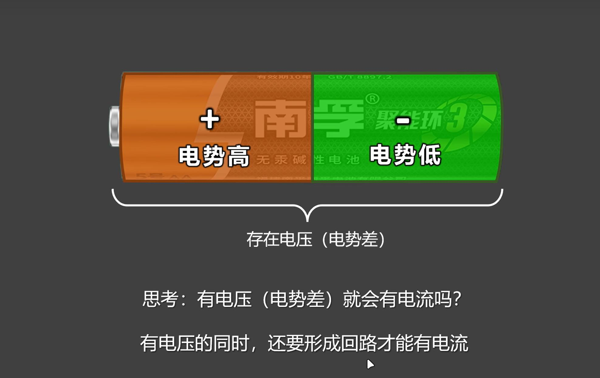
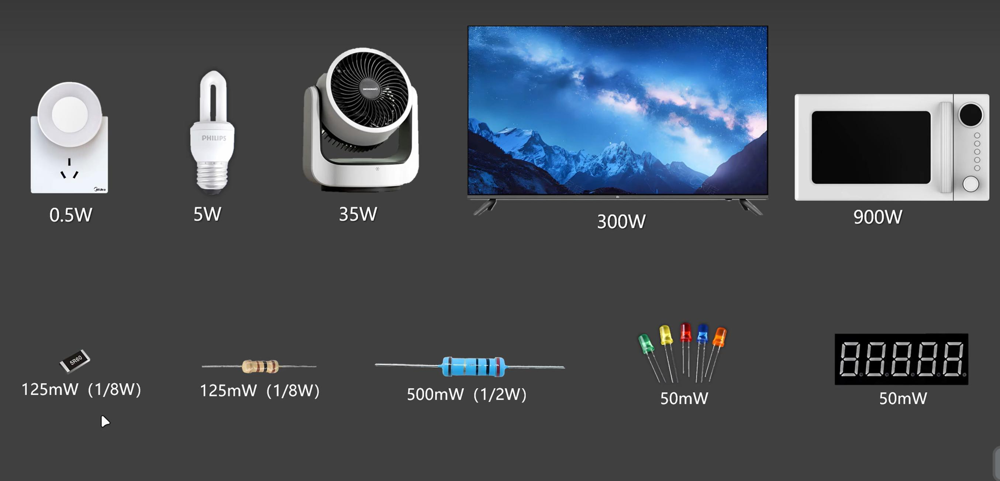
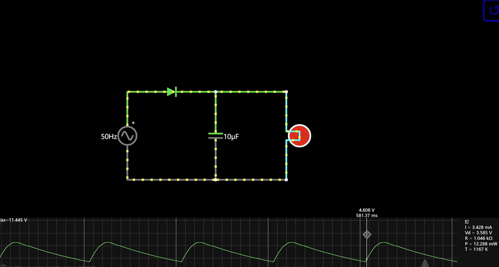
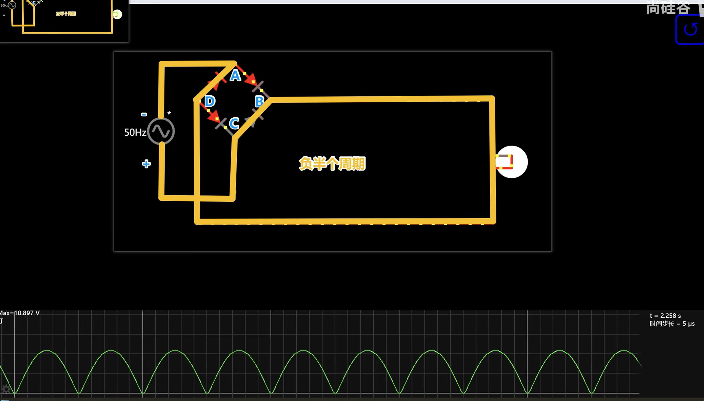
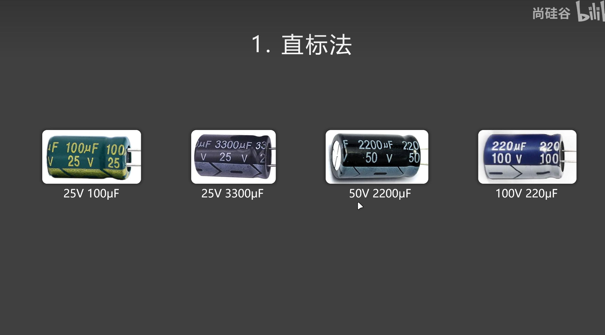
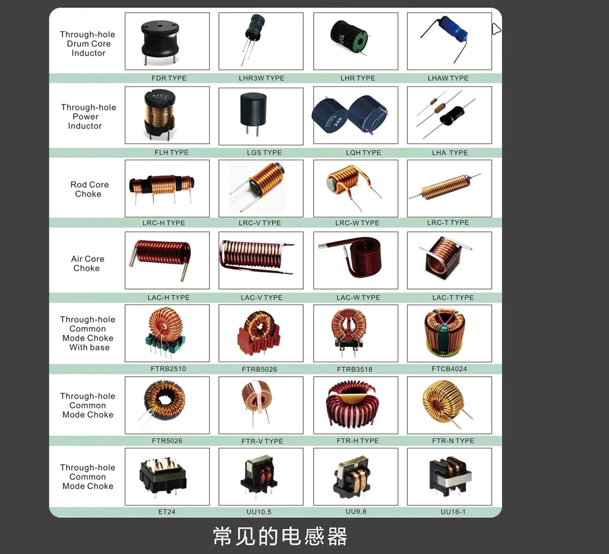
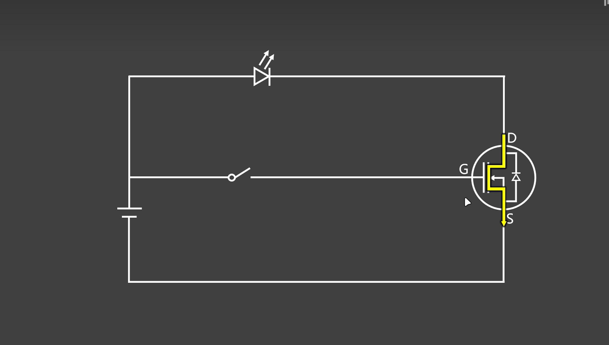

#电子电路笔记
## 电流
- 电荷的定向移动，形成了电流，衡量电流的大小，要看单位时间内通过导体横截面的电荷量
- 对于金属导体来说，是负电荷在定向移动
- 单位：安培（A）简称:安
- 1A的定义：在1秒钟内有6.242x10的18次幂个单位电荷通过了导体的横截面
- 6.242x10的18次幂个单位的总电量为1库伦
- 单位换算:进位为1000，例如1A = 1000mA
- 电子的移动方向是从负极到正极
- 电流的移动方向是从正极到负极，因为规定的是正电子的移动方向，但实际中正电子并没有移动
- 而是负电子在移动，所以也没啥毛病
- 
## 重力势能
1. 物体在重力场中所具备的能量
2. 与所处位置、物体质量，均有关。
## 重力势
1. 重力场中某个位置给物体"赋予重力势能"的本领
2. 与质量无关，与位置有关，是重力场的特性。
## 电势能：
1. 描述带电粒子在电场中所具备的能量。
2. 与所处位置、粒子带电量，均有关。
## 电势：
1. 描述电场中某位置给带电粒子"赋予电势能"的本领。
2. 与试探粒子带电量无关，与位置有关，是电场的特性。
3. 
4. 
5. 
## 单位时间内通过任何材料的电流如果过大，可能会把材料烧坏，比如通过变压器慢慢把电压调大，
## 此时，通过灯泡的电流可能会把灯泡烧坏，一般情况下设计二极管的时候，都要加电阻，防止单位
## 时间内经过的电流过大烧坏二极管
## 电压越大，电流也就越大，
## 实验结论
- 升高电压后，就会产生更大的电流，通过的电流变大，LED就会更亮一些，电机也会转
- 的更快一些，但是电压不能无限增大，过大的电压会产生过多的电流，导致LED和电机烧毁
## 阻碍电流的流动就是电阻
- 电阻是电子学中的基本概念，它是指电流经过导体时阻碍电流流动的程度。电阻的单位是欧姆
- 电压，是推动电子的流动，电阻是阻碍电子的流动
- 1Ω=1000mΩ
- 电阻的大小不仅与材料有关,还与材料的粗细，长短等因素有关
- 
## 欧姆定律 是电学中的基本定律之一
- 它描述了电流和电压之间的关系。
- 导体中的电流与导体两端的电压成正比,与导体的电阻成反比。
- 欧姆定律的公式为：I=U/R,其中I是电流，U是电压，R是电阻。这个公式表明，
- 在电阻不变的情况下，电压和电流成正比。
- 
- 
## 交流电和直流电
- 
- 
- 
## 串联电路
- 
## 电功率
- 
- 
- 
- 
## 焦耳定律
- 
- 
## 公式推导
- 
- 
## 电子元器件
- 
- 
## 电阻器
- 
- 
- 线绕电阻 
- 碳膜电阻  四色
- 金属膜电阻  五色
- 
- 固定电阻-贴片电阻
- 厚膜电阻、薄膜电阻 
- 
- 固定电阻 金属箔电阻
- 
- 
- 可调电阻 
- 保险丝 
- 光敏电阻 
- 光越亮,电阻越大,电流越小,灯就不亮
- 
- 压敏电阻 
- 
- 
## 电阻生产标准
- 
- 
## 电容和电池
- 
- 
- 
- 
- 陶瓷电容（电子工业大米）
- 点解电容（有正负级之分） 
- 可调电容（可调电容的电解质是空气） 
- 超级电容 
- LED 较长的为正极、短的为负极
- 面包板 
- 电容器充满电的时候一定要用万用表去量一下电压，一定要带手套，一定要注意放电，电容很危险
- 电容器充电模拟
- 电容充电的过程，电压越来越大直到跟电源电压大小一样（电容充电的阻碍越来越大），电流越来越小（电子越来越难以穿过）
- 电容放电的过程，电压越来越小
- 隔直流，在接通电源的一瞬间情况下，并没有隔直流，而是在电容充满电之后才算是隔直流，至于这一瞬间的电流有多大，取决于电源的电压与电容的容值
- 通交流，也不是说电容会导通，而是通过高频次的充放电实现通交流
 - 
- 容抗，电容器对电流是有阻碍作用的，并且随着充电时间越来越大，电容对电流的这种阻碍，我们就叫做容抗
- XC = 1/2πfc
- 电容容值c固定，信号的频率f越大，容抗越小
- 信号频率f固定，电容的容值c越大，容抗越小
- 电阻与电容都会阻碍电流，二者的区别是，电阻会发热，电容不发热
-  
- 电路中的总阻力，描述的是电路中多种因素对电流的总阻碍作用，阻抗包括电阻、 容抗、 感抗
- 电容器-滤波（滤波就是把一个波动比较大的电压变为一个波动比较平滑的电压）  
- 加入二极管后表现，由于二极管只能单向通过电流，所以会屏蔽半个周期
- 加入电容后，只需要调节电容大小,会让电压周期图中间的半个周期表现比较连续，不再出现断档
- 半波整流，效率不高（把交流电变成直流电的过程叫整流）
- 电容器弥补了丢失了的负半个周期
- 滤波就是把波动区比较大的电压变成波动区比较小的电压
- 容抗不变的情况下，容值越大，说明频率越小，这就是通低频阻高频
- 容抗不变的情况下，容值越小，说明频率越大，这就是通高频阻低频
### 全波整流（二极管制作的整流桥）
- 交流电的每个周期都用上了
- 正半个周期（电流只能从高电压流向低电压） 
- 负半个周期 
- 
## 陶瓷电容
- 
- 
- 一层一层的，每个陶瓷电容，至少1000多层，制作工艺也是越来越厉害
- 
## 电解电容
- 
- 
- 常见的电解电容
- 怎么能提高电容的容量呢，增大长度呗，所以一般工艺制作都是卷起来制作的
- 拆分电解电容 
- 阳极板明显发暗，阴极板明显发亮的，阴极板是比较薄的铝片，阳极板是比较厚的铝片，阳极板这边有一个氧化层
- 
- 瞬间要有能量释放，适合电解电容的特性
## 空气电容
- 
## 超级电容
- 特点：极快的充放电速度
- 
- 
- 
- 
- 
- 
- 
### 容值识别
- 直标法 
- 乘方数表示法 
- 字母表示法 
- 贴片电解电容
## 安培定则
- 
## 法拉第定律
- 只要闭合电路的磁通量发生变化，那么闭合电路中就会产生感应电流
- 感应电流的大小，与线圈磁通量的变化率（变化的快慢）有关
- 磁通量变化率越大，产生的感应电流越大
## 磁通量
- 
## 楞次定律
## 感应电流所形成的磁场，总要阻碍引起感应电流的磁通量变化
- 
- 在感应线圈处移动磁铁也是可以产生电流的
## 电感器
- 电流从小变大时，会阻碍电流的变大
- 电流从大变小时，会阻碍电流的变小
- 电感器是电能与磁能之间的相互转化，实现了平滑电流，对电流有一个"来拒去留"的反应
- 电流突然出现，或突然变大，电感器会抑制一下，让它平缓的出现或变大。
- 电流突然消失，或突然变小，电感器会抑制一下，让它平缓的消失或变小。
- 电感器时 "磁能的暂存器"
- 电感的决定式
- 
- 电感器单位】
- 
- 电感器参数
- 
- 常见的电感器
- 
- 感抗
- 
- 
- 电感器 储能
- 在嵌入式开发中，电感主要用于动态能量转换和瞬态保护，而非长期储能
- 
- 
- 电感值的读取
- 
- 通直流隔交流，对直流无阻碍作用，几乎无感抗，对交流， 有阻碍作用，有感抗
- 电感值相同，频率不同 对低频交流，阻碍作用小，感抗低  对高频交流，阻碍作用大，感抗高
- 频率相同，电感值不同 电感值小，阻碍作用小，感抗低    电感值大，阻碍作用大，感抗高
## 电磁继电器
- 
- 
## 蜂鸣器
- 
- 
- 
-  蜂鸣器电路图
- 
- 二极管是为了保护三极管的,因为电感会产生感应电流,感应电流总会阻碍电流的变化，会阻碍电场的变化，在断开开关的时候,为了阻碍电场发生变化，
- 会产生一个强大的电压,可能有几十V,如果三极管导通的情况下电流会从高到低，直接流向地,但是如果三极管没导通,那么可能会击穿三极管,此时在蜂鸣器的
- 电感两端接一个二极管,因为三极管不导通,可以看成是高阻态,此时二极管的阻力小,所以高电压会流向5v
## 半导体
- 
- 没有半导体就没有现代科技
- 更高端的半导体技术--科技领域话语权！
- 
- 
- 
- P-N结 
- P是空穴多一点，N是电子多一点，两者放一块的时候，N的电子会往P的空穴走一部分，
- N的左半部分由于缺少电子，所以带正电
- N的右边部分因为有电子，所以带负电，所以形成了一个内建电场
- 因为电子是从高电压到低电压的流动，所以当这个内建电场形成一定的强度后，N区的电子
- 就不会到P区了，并不是真的过不去了，而是达到了一个动态平衡，过去一个电子，就会再回来一个
- 反向接通电源，P-N结不会导通，内建电场电压区域变大，电压变大，所以电子过不去 
- 
- 反向击穿电压，如果电源电压足够大，还是会击穿二极管的，如果在二极管的承压范围内还好，否则会烧毁二极管
- 
- 
## 购买元器件，去立创商城，买不到假货
## 电阻的数据手册，我们需要关注的是什么
- 封装:看电阻是什么样的，是直插的还是贴片的，大小是多大。
- 标称:看电阻表的电阻值是多少，精确度是多少，误差1%，还是5%，还是20%的，精度越高越贵
- 额定功率:额定功率是P = I*I*R = I*U,额定功率其实决定了耐压值。电阻能通过的最大电流是
- 固定的，额定功率越高，耐压值就越高，超过了电阻的耐压值会导致电阻烧毁。
## 二极管
- 
- 直流电与交流电（脉冲直流电） 
- 关注参数 
## 整流桥 
## 稳压二极管
- 
- 
- 稳压二极管的妙用，无论与它并联的电路中的电阻如何变化，经过稳压二极管的电流如果还在稳压二极管的最大电流范围内，
- 稳压二极管还是能够保证它两边的电压不会有太大变化
- 稳压二极管的作用，必须达到稳压二极管的电压之后才会导通电流，不然不会生效
- 稳压二极管必须在电路中有电阻，否则会因为电流过大被烧毁
- 
- 常见稳压二极管，一般是玻璃封装
- 关注参数
- 电致发光效应 简单说就是电能和光能的互相转换
## 发光二极管
- 
- N沟道增强型
- N沟道增强型
- P沟道增强型
- P沟道增强型
- P沟道增强型
- P沟道耗尽型
- P沟道增强型和耗尽型
- P-N结构其实就是正极指向负极
- 识别MOS管
- MOS管参数 输入电容和反向传输电容会影响开关时间
- 
- MOS管应用场景 开关关闭的时候
- 开关断开的时候 MOS管还是导通的，因为三极管的GS组成有点像电容
- 
- 
- 

## 开关电路
### 用电去控制电是计算机工作的核心原理
- 开关电路是一种基本的电路，它可以控制电流或电压的流动或者输出。简单的讲就是用电来控制负载
- 电流或电压的流动或输出。开关电路在现代电子技术中有着广泛的应用，是电子电路设计和实现中必不可少的一部分。
- 用电去控制电，也是计算机工作的核心原理。
## 用电信号去控制电
- 继电器、真空管和晶体管都是用于实现电信号的开关控制的电子元件，继电器最容易理解。
- 继电器是一种电气元器件，它通过接受一个电信号来控制另一个电路中的电压或电流。
- 继电器通常由一个磁铁和一个电磁线圈组成。当通过线圈流过一定电流时，磁铁会产生磁场，使触
- 点间距变小，进而接通电路。继电器由于具有绝对稳定、高效率、长寿命、安全可靠等优点，因而
- 在自动化、电力、通信、电子等领域中广泛使用。
- 继电器用到了电和磁的特性
- 通电的螺线圈会产生磁场
## 三极管
- 三极管也是一种用电去控制电的元器件
- 理解三极管需要先介绍一下半导体和二极管
- 我们都听说过硅半导体，其实纯净的硅导电性很差，接近于绝缘体，基本上是不导电的。但是再硅
- 中掺杂一些三价磞五价磷硅的导电性就会增加。
- p的英文是positive,带正电
- n的英文是negative,带负电
## 二极管
- 二极管是一种电子元件，它由两种不同类型的半导体材料制成。
- 这些材料被安排在一起，形成了一个名为P-N结的结构。
- 这种结构使得电流只能沿一个方向通过二极管，而另一个方向则无法通过。
- 因为二极管只允许电流在一个方向上通过，所以它在电子学中有很多用途。
- 例如，我们可以使用二极管制作电池充电器、电源适配器和许多其他电子设备。
- 封装模式：DIP8是直插，长宽高比较大，占空间 SOP8是贴片，体积小，占空间小

## 或非门 电子电路中一种常见的元器件
- 或非门的输出信号取决于所有输入信号的状态，但是只要有一个输入信号是高
- 电平，那么它的输出信号就会是低电平。
- 只有当所有的输入信号都是低电平时，它的输出信号才会是高电平
- 换句话说，或非门就像一个大门，只有当所有的输入都是关着的（低电平），才会
- 打开大门（输出高电平），否则大门就会保持关闭（输出低电平）
## 下拉电阻
- 起因 当电路断开的时候，如果空气中有各种波，可能导致电路会被输入不确定信号，那么此时直接接地
- 会导致电路短路，此时接一个下拉电阻，注意阻值小于电路中的电阻，这样相比较，你找个小电阻就相当于
- 是短路
## 上拉电阻
- 相反，如果默认电路是低电平工作，所以在不工作的时候，为了避免高阻态，所以需要接入上拉电阻，上拉电阻
- 连接vcc
## 限压电阻
- 为了分担电路中的其他用电器的电压，需要使用限流电阻，按照经验来说，电阻应该吃的电压稍微小一点
- 
## 拔电源的时候先拿正极，再拿负极
- 通电螺线圈总会产生感应电流，感应电流总会阻碍电流的变化
- 电感的作用，通直流，阻交流，交流电的频率越高，感抗越高，电流变的快，磁场变化就快，磁场变化快，磁通量变化就快
- 变化率大，产生的感应电动势或感应电流就大，阻碍作用就大
## 记忆 区分三极管
-
## 记忆 区分MOS管
- 
- 二极管方向
- 
## 三极管与MOS管的区别
- 