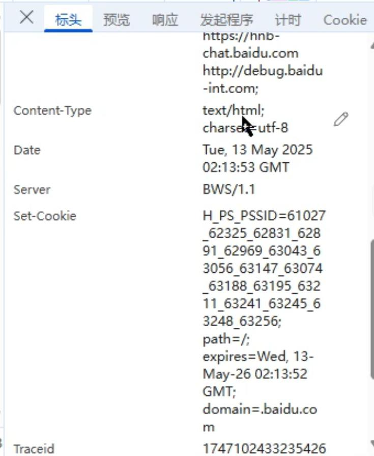
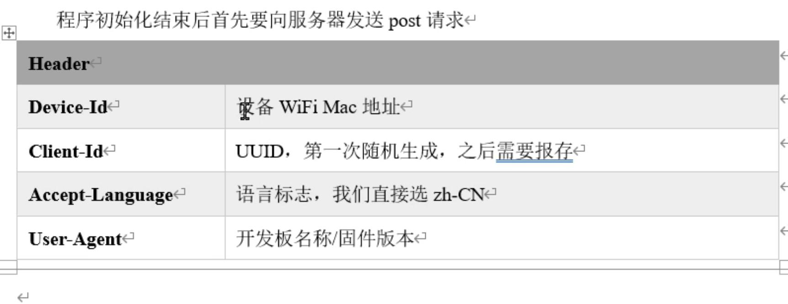

## iic不对等协议，有主从关系
- mac地址，物理地址一串数字，不太好记，然后又做了一个约定，叫tcpip协议，约定好各自的ip地址和子网掩码，ipv4协议是32位（192.168.100.111）4段，每段8位
- 前24位叫网络编号，后8位是本身的地址，子网掩码255、255.255.0，每个设备的ip和子网掩码会绑定自己的mac地址
- 每台设备的跟谁通信都会做一些缓存，记录别的设备的ip和子网掩码，方便通信
- tcp可以连续的发数据，可以连续的收数据
- 当两台机器进行通信时，是会把ip地址再转换成mac地址的
## http协议
- http就是在tcpip协议之上的一个应用层协议
- http协议是客户端发请求，服务器进行响应。服务端不会主动給客户端发请求的
- 
- http分为标头和内容的，也就是header和body，header是约定的一些协议比如压缩格式，比如内容格式，数据格式
- 当收到response的时候会收到具体的响应标头，比如json、html/txt等
- get就是我不需要向服务器发数据、只需要服务器给我响应就行
- post是请求的时候需要带数据，不仅仅是header，body也会有数据
- 
- 标准的http请求会有一个很长的头文件
## websocket
- webscoket不用像http那样每次都得建立连接
- websocket首次进行连接的时候，双方会把socket缓存下来
- websocket手法数据还是会带有头文件的，socket的话不会带这些数据，比标准的http协议简化了很多，提升不少效率
- 是能区分文本和二进制的
- 方便传输各种类型的数据
- 服务器可以连续的給客户端推数据
