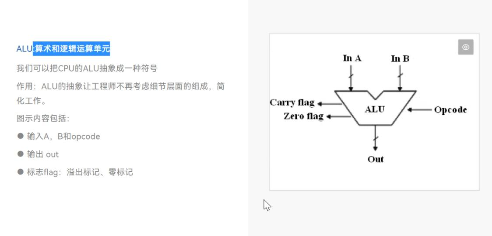
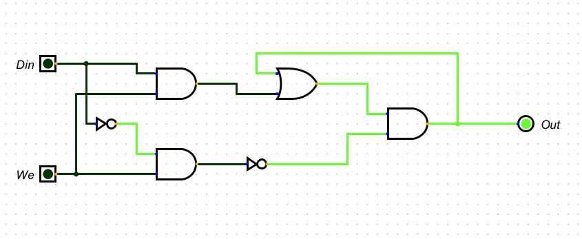
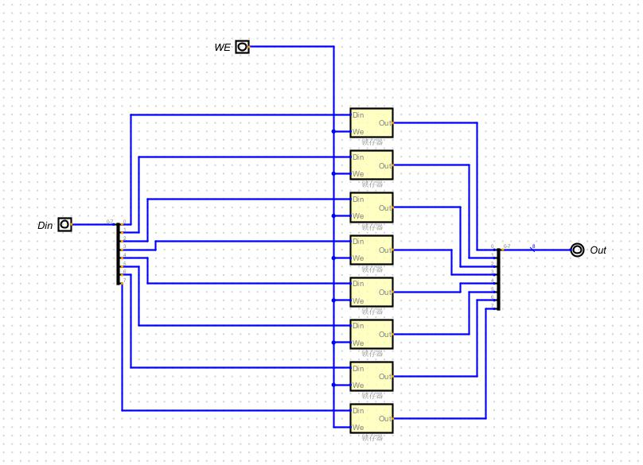
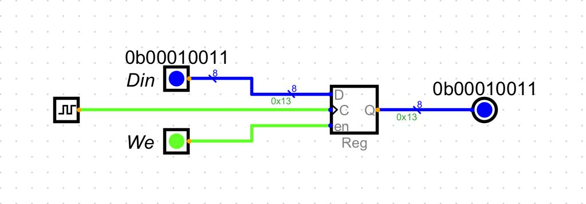

## 计算机组成原理
- 现代电子计算机的实质
- 一层层的套娃
- 通过最简单的组件，经过一层层的抽象，做出来复杂的操作。
- 计算器最底层的原理是非常简单的，难的是一层层精妙的抽象
- 像乐高积木，使用最简单的平淡无奇积木，拼出来令人惊奇的城市。
## 元器件的变化
- 继电器->真空管->晶体管
- 继电器，真空管和晶体管是用于实现电信号的开关控制的电子元件。
- 我们上课先用最大最直观的继电器给大家做讲解，其他元器件原理都是一样。
- 只是体积做的越来越小，现在晶体管开关的最小尺寸可以做到3nm左右。
- 从1945年到现在计算机的电路原理和结构没有发生变化，变化的只是制作工艺。
## 位值计数法
- 基于位值和数值的一种计数方法
- 位值计数法是一种数字表示方式，它是基于位值来确定数字的大小的。
- 在位值计数法中，每一个位值上的数字都有一个对应的权值，这个权值
- 是基于它所在的位置而定的。
## 二进制相关概念
- bit位
- 计算机中的一位二进制表示：
- 单个数字1或0,1位二进制数字命名为位（bit）,也称1比特
- byte字节
- 1byte = 8bit,即1byte代表8位数字。最早起的电脑为8位的，即以
- 八位为单位处理数据。为了方便，将八位数字命名为1字节
## 8个bit是一个byte
- 迅雷下载或者很多下载软件下载速度10M/s准备的讲是10Mbit/s
## 32位和64位
- 2的32次幂结果是 43亿左右
- 2的64次幂结果是 9.2*10^18
## 二进制表示文字
- 统一人类语言
- 通过码表，我们把计算机0011的二进制符号和人类语言的符号建立了映射关系
- 1992年诞生，随着计算机在亚洲兴起，需要解决每个国家码表不统一的问题，
- 为了提高代码的互用性，而诞生的编码标准。UNICODE为16位数字，理论上有2的16次方，
- 也就是有超过100万个位置，可满足地球上所有语言的字符需求
## 灰度图
- led灯可以通过PWM等技术区调节亮度，这样就可以表示不同的亮度，从黑（不亮）
- 到百色（最亮），每个像素点通过一个0-255的8bit的数字（1byte）来表示，
- 所以28*28像素的灰度图图片需要784个byte来表示。
## 彩色图
- 用0~255*255*255表示颜色数据。
- 每一个像素点由RGB三种颜色组成。
## 二进制如何表示声音
- 采样：将声音信号按照一定的时间间隔进行采样，把每个时间点上声音信号的
- 振幅转换为数字数据。采样率越高，转换出的数字数据越精确，但也需要更多的
- 存储空间。
- 量化：将采样得到的连续的模拟信号，转化为一些列的离散的数字化信号
- 将振幅值转换为数字，常见的方法是将其按照一定的精度进行取样，通过使用16位
- 或24位精度 
- 声音就是一个模拟信号转化为数字信号，然后存储起来
- 采样率决定了声音的音质，采样率越高，音质越高
## 二进制如何表示视频
- 视频 = 图片+声音
- 把图片+声音按照时间线存储起来就是视频
- 再数字视频中，视频帧被分解为数字像素，并将每个像素表示为二进制数。
- 每个像素通常由三个分量表示：红色、绿色和蓝色分量，即
- RGB值。每个分量通常使用8位二进制数（即一个字节）表示，因此每个
- 像素由24位二进制数（即是那个字节）表示。
- 视频的每一帧都由一些列像素组成。如果视频的分辨率为1920*
- 1080（高清1080p），即每一帧将包含1920*1020=2073600个
- 像素。对于每个像素，计算机将RGB值编码为二进制数字，并将所有像素编码成一长串二进制数字序列
- 这个序列被存储在计算机的硬盘驱动器中，以便以后可以被读取和播放。 
## 布尔运算和逻辑运算
- 用计算机进行0和1的运算
- 布尔运算和逻辑与那算概念类似，布尔运算时数学界的说法，逻辑运算是计算机界的说法
- 布尔运算是基于布尔代数的一种数学运算，它使用真和假值进行运算。
- 逻辑运算是电路设计中的运算，它和布尔运算类似，但是用于在电路中进行运算，逻辑运算
- 包括与或非。
- 布尔运算的基本运算符包括与、或、非和异或。布尔运算的结果只有真或假两种可能，通常用于程序
- 中的判断语句和逻辑控制
## 与或非是计算机逻辑门的最基础的部件，其他任意的部件都可以通过与或非三种门来表示
## 布线的时候线条可以加粗，如果电流过大还是要粗一点
## ALU 
- Arithmetic Logic Unit 是计算器CPU中的算术逻辑单元，它负责处理计算机中的数学运算和逻辑
- 运算。它可以执行基本的算术运算（加减乘除）和逻辑运算（与或非），并且根据
- 运算结果产生相应的输出。ALU是CPU中最重要的部分之一，负责实现计算机的基本运算功能。
## 半加器
- 只能完成一半功能的加法器
- 这里说的一半功能就是他不能接收到进位
- 0+0 = 0
- 0+1 = 0
- 1+0 = 0
- 1+1 = 0
## 全加器
- 如果一个加法器能接收进位，还能完成加法，那他就是一个全加器
- 一个全加器由两个半加器组合而成
## 二进制的加法运算非常简单
- 跟十进制一样，按位相加，不过不是逢十进一了，而是逢二进一
- 上拉电阻默认为高电压
- 下拉电阻默认为低电压
## 为什么用我们自己的或组件会有问题，因为输出要设置默认值，默认值通过上拉下拉电阻处理
## 否则的话会浮空随机
## 千年虫危机？因为硬件和软件没有同时做处理，也算是一个数据溢出问题吧，19 + 1成了00
## Decimal 无符号的整数 0000 0000 ~ 1111 1111 256种组合 0-255
## Signed Decimal 有符号的整数
## 符号位 0 正数 000 0000 ~ 111 1111 0-127
##        1 负数 000 0000 ~ 111 1111 -127-0
##        +0 -0都是0，如果采用传统的计数方法，需要存一个正0和一个负0，比较浪费空间
## 补码 
- 把一个整数的二进制按位取反，然后再加一就是负数的补码表示方法。
- +0和-0），因此更加方便和精确 1000 0000 -128
- 计算器中存储的负数为补码，所以正数+负数 = 正数+负数的补码就行
- -3 1000 0011 => 反码 1111 1100
- 5  0000 0101 
- +  1111 1101  
- =  0000 0010  = 2
## 计算机完成其他运算
- 加法和减法都是用加法电路来完成。
- 乘法就是多次的加法
- 除法就是多次的减法
- 所以加减乘除都是同一套电路逻辑
- 现代计算器提高效率可以设计专门带有移位的乘法除法电路，
- 为了计算带小数的乘法和除法也可以设计专门的电路。
## 零检测电路，只需要把所有的数据进行或运算即可。
## CPU的核心工作部件-ALU
## ALU:算术和逻辑运算单元
- 我们可以把CPU的ALU抽象成一种符号
- 作用：ALU的抽象让工程师不再考虑细节层面的组成，简化工作
## 只能进行算术逻辑运算的叫计算器
- 计算器主要用于数学运算，包括加减乘除等
- 而计算器可以进行各种复杂的任务
- 计算机可以编程，计算器不能编程
- 计算机相比计算器的高级之处，是计算机能记忆数据，并且还可以编程。
## 计算机要运行复杂程序，必须要能记忆数据
- 这种记忆可以是临时的，也可以是长期的。
- 计算机的数据保存在内存（RAM）中的，断电数据就丢失了，你的数据是保存在
- 硬盘中的，断电数据还在。
- 内存中的数据是临时的，硬盘中的数据是长期的。
## 机械硬盘，跟以前的磁带差不多
- 硬盘就是根据有磁没磁去存储的
## 固态硬盘，通过闪存技术存储的
- 利用半导体物理，往某一个晶体管中写入一个电子或者擦除这个电子
## 文件粉碎机的原理，就是在原有文件的基础上反复覆盖创建删除垃圾信息，把原先的文件改的面目全非
## 内存是如何存储数据的
-  
- 可以记忆的电路，或门能记住1，与门能记住0
- 双稳态触发器就是用来记录数据的
## 锁存器
- 与门可以存储下来0，或门可以存储下来1
-  
## 寄存器
- 一个寄存器 = 8位锁存器/16/32位
- 一次可以存储8位数据。
- Din data in 数据输入，
- WE write enable
- 当WE为高电平的时候，Din的数据可以被存储起来
- 当WE为低电平的时候，out的值不发生变化
- 
## 带边缘触发的锁存器
- 
- 为什么需要时钟
- 大家都见过划船的，划船需要一个喊口号的主要原因是为了保证协调。通过喊口号
- 船员们可以同步动作，确保船在平稳且有效率地前进。
- CPU需要clock来同步内部操作，如执行指令、进行数据传输等。
- Clock提供了精确的时间控制，确保每个内部操作在正确的顺序与速度内执行
- 从而确保CPU的正常工作。另外，Clock还与CPU的频率相关，通过
- 控制Clock的频率，可以控制CPU的速度。
- 时钟信号是什么
- 时钟信号就是周期性的高低电平变化的信号
- 我们可以用两个普遍的寄存器加上一个非门，组成一个带有边缘检测的寄存器。
- 在按钮按下的一瞬间，电压从低电平到高电平的一瞬间，Din的数据被存储起来。

## 输出允许模块
- 空气的电阻是非常高的，有几兆欧，可以等效的认为是高阻态
- 下图是一个8位的总线允许模块设计效果
- 用于将信号连接到其他导线，如果sel输入为低电平，输出为高阻状态，如果sel
- 为高电平，输出等于输入
## 16位寄存器
- 存储器-寄存器
- 16条输入Din
- 1条We
- 1条clock
- 1条OE
- 16条输出Dout
- 一共需要35条信号线
## 64位寄存器需要多少条线
- 64条输入Din
- 1条WE
- 1条OE
- 1条Clock
- 64条输出Dout
- 一共需要131条信号线
- 内存地址的作用主要是为了节省数据线，简化电路数量
## 内存地址：从并行到串行
- 先设计一个内存单元格
- 内存单元格要自己在哪一行和那一列，需要有row和column
- 内存单元要有ld(load)读的控制
- 内存单元要有str(store)存的控制
- 内存单元要有数据的输入
## 计算机系统的核心组件
- 要画出一个基本的计算机系统需要以下组件：
- ALU（算数逻辑单元）：ALU是CPU的核心组件，负责执行所有算数和
- 逻辑操作，如加、减、乘、除、与、或、非、异或等
- 寄存器：寄存器是CPU中的存储器件，用于存储数据和指令。
- 内存：内存是CPU外部的另一个重要组件，它用于存储程序和数据。CPU
- 需要一个内存管理单元剧来管理内存的读写操作。
- 时钟：时钟是CPU中的一个电子组件，它提供CPU的时序信号，确保所有
- 操作都按照正确的时序执行。
- 控制单元：控制单元是CPU中的重要组件，它控制数据和指令在CPU内部的流动
- ，并确保他们按照正确的顺序执行。
## 汇编语言与机器指令
- 汇编语言是对机器指令的文字版抽象
- 方便我们更容易的理解机器指令
- 汇编语言由操作码和操作数组成
- 0000 LOAD_A
- 0001 LOAD_B
- 0010 ADD
- 0011 STORE
- cpu指令集 汇编语言LOADA,LOADB,ADD,STORE
- 
## EPROM和flash
- EMROM和Flash都是可编程只读存储器（Programmable Read-Only Memory,PROM）
- 它们都可以用于存储程序代码和其他类型的数据。
- 可编程可擦除只读存储器（Erasable Programmable Read Only Memory,EPROM）
- 是一种可写可读的存储器。用户可根据需要来写入，并能把已写入的内容擦去后再改写的ROM
- 这种存储器擦除原内容的方法很有特点，可以使用点的方法，也可以采用紫外线照射的方法进
- 行擦除数据。
- Flash可以通过电子方式进行擦除，这种擦除方式称为电子擦除（Elertrical Erase），通
- 常使用高电压或者脉冲电压来擦除数据。
- 这两种存储掉电都会保存，现代单片机的存储代码很多都是用flash来实现
## CPU执行程序的流程
## 包含取指与执行两个周期
## 取指周期：
- 1.把PC(程序位值计数器)的值放入MAR(内存地址寄存器)
- 2.PC的值加1，指向下一条程序指令
- 3.把MAR地址指向的内存中的数据取出来（操作码+操作数）放入MBR(内存缓存寄存器)
- 4.把MBR的数据放入IR(指令寄存器)
- 执行周期：
- 1.decode操作码
- 2.根据操作码确定是LOAD_A还是LOAD_B还是add还是store指令
- 3.不同的指令对应不同的操作
## 简化与抽象：寄存器
- 4位的寄存器用于程序计数器(PC)和MAR(内存地址寄存器)
- 8位的寄存器用于指令寄存器(IR),CPU通用临时寄存器（RegA）、（RegB）,
- 内存缓存寄存器（MBR）等。
- 分别测试4位和8位的寄存器